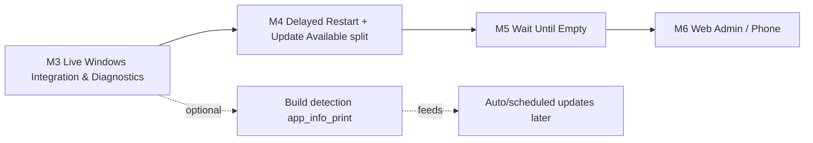

# Conan Server Control — Architecture Review

> Reviewer: CONAN ARCHITECT · Review 1 (rev. 2, re-scoped to PR #1) · 2026-10-01 (UTC+7)
> Reviewed head: **PR #1, `cursor/conan-server-control-a853` @ `593d9d6167aa8091e90d3529ba23daf1804ad487`** ("Fix update-pipeline lock and wire real Workshop updates."). Previous review baseline: `280d27d`.
> Inputs read: `STATUS.md`, `HANDOFF.md`, `README.md`, `docs/*`, all `src/**` and `tests/**`. **`QA_REPORT.md` does not exist at this head.**
> Box facts: .NET SDK 8.0.425 on Linux. `dotnet build ConanServerControl.sln -c Release` → **0 warnings / 0 errors** (the WPF project compiles thanks to `EnableWindowsTargeting`; it was not run). `dotnet test` → **29/29 passed**.
>
> **Legend:** **[VERIFIED]** = read in code, or reproduced with a throw-away probe test (in `/tmp`, not committed) against this head. **[WIN-ASSUMPTION]** = Windows/Conan Enhanced behaviour that needs a real host. **[DESIGN]** = recommendation.

> **SUPERSEDED IN PART (2026-10-01 23:50 UTC+7).** Sections "Current Assessment" through "Appendix B" below are the **rev. 2 review of `593d9d6`** and are kept as history. The stabilization milestone (PR #1 → `b422e1f`; QA final in PR #2 @ `581d208`: PASS WITH ISSUES, 108/108) changed these facts:
> - F-1/F-2 (convention-only lock, ungated Mods page) → **resolved**: `IServerActionGate.TryBegin` issues `IServerOperationLease`, `*UnderLockAsync` require it and validate via `Owns` (`ServerActionGate.cs:17-22`), and restore and Mods-page updates take the gate (QA-005/008/012).
> - F-3/F-5 (stale staging, no rollback) → **resolved**: fresh staging plus single-pak validation (`WorkshopModService.cs:453-513`), `ModBatchTransaction` isolated rollback with fail-closed verification (QA-002/006/016).
> - F-4 (invariant) → **resolved** for success and failure paths (QA-003/004/006/016). Restart only after no-mutation or a *verified* rollback (`ServerUpdateService.cs:221`).
> - F-7 (restore deletes its source) → **resolved** (QA-001), and incomplete backups now fail (QA-007).
> - F-9 → **partially** resolved: Web endpoints still pass `http.RequestAborted` (`WebAdminExtensions.cs:243-268`), and `ProcessRunner` kills only on *timeout*, not on caller cancel (`ProcessRunner.cs:218-224`).
> - **Still true:** the pipeline backup runs **before** stop (live copy; `ServerUpdateService.cs:133-144`); UpdateAll re-downloads every enabled mod; the RCON password cannot be set from the UI and the UI edits `Server.RconPort` while `RconService` reads `Rcon.Port` (`SettingsViewModel.cs:129`, `RconService.cs:47`), so graceful stop/broadcast is unreachable [WIN-ASSUMPTION impact]; `GameDbRelative` = `game.db`; the remote build check is not implemented.
> - The **current decision** is in **# Post-Stabilization Roadmap** at the end of this document. Where it conflicts with an earlier section, the roadmap wins.

---

## Current Assessment

PR #1 fixed the headline P0 from my first pass: **Update Server no longer self-deadlocks**. `RunLockedAsync` takes the gate once and calls `StopUnderLockAsync`/`StartUnderLockAsync` (`ServerUpdateService.cs:92-186`), and the missing state-machine edges were added (`UpdatePipelineStateMachine.cs:136-144`). Workshop metadata via keyless `GetPublishedFileDetails` is a good addition (`SteamWorkshopClient.cs`). UPDATE EVERYTHING is now *one* locked run (backup once, stop once, start once) instead of a ViewModel-composed sequence.

The **update transaction is still not safe**. These are verified at `593d9d6` with probes (output quoted):

| # | Finding | Probe output | Severity |
|---|---|---|---|
| F-1 | The lock is enforced only by convention. `EnsureLockHeld` checks `_actionGate.IsBusy` (`ServerProcessManager.cs:161-170`), so **any** caller can stop/start the server while **someone else** holds the lease | `PV2-2 stop-under-foreign-lease: status=Offline` | High |
| F-2 | The Mods page bypasses the gate entirely. UPDATE SELECTED/UPDATE ALL call `IWorkshopModService.UpdateAsync/UpdateAllAsync` directly (`SettingsViewModel.cs:463-495`), so there is no lock, no backup and no stop, and paks are replaced **while the server runs and while another pipeline holds the lease**. Enable/Disable/Move rewrite live `modlist.txt` with no lock (`SettingsViewModel.cs:340-440` → `WorkshopModService.SetEnabledAsync/MoveAsync`) | `PV2-5 mods-page update while online & gate held: status=Online downloads=1 backups=0` | **P1** |
| F-3 | **Stale staging pak installed and recorded as updated.** Staging `staging\workshop\<id>` is reused, and the first `*.pak` found wins (`WorkshopModService.cs:244-268`). The mod is then marked `InstalledTimestamp=now, UpdateAvailable=false` (`:291-298`) | `PV2-4 stale: livePak=OLD-STALE updateAvailable=False installedTs=set` | **P1** |
| F-4 | **Server-state invariant violated.** Dashboard/Web call `UpdateAsync(restartAfter:true)`/`UpdateModsAsync(true)` (`DashboardViewModel.cs:116,119`, `WebAdminExtensions.cs:231-237`), and `UpdateEverythingAsync` hardcodes `restartAfter:true` (`ServerUpdateService.cs:89-90`). An **offline** server ends **online** | `PV2-1 offline->UpdateServer(ui): status=Online` · `PV2-1b offline->UpdateEverything: status=Online backups=1` | **P1** |
| F-5 | **A failure leaves a previously online server offline**, with no compensation (`ServerUpdateService.cs:174-184`). Mods updated before the failing one stay swapped (there is no rollback) | `PV2-3 after failed mod update (was online): status=Offline` | **P1** |
| F-6 | modlist.txt gets `"<Name>.pak"` for a never-installed mod (`ModListGenerator.cs:69-85`). `CheckForUpdatesAsync` also copies Steam's `filename` into `LocalFileName` for **uninstalled** mods (`WorkshopModService.cs:191-194`), and a test asserts it (`WorkshopUpdateTests.cs:75`), so *metadata* gets written as *install state* | `PV2-6 modlist for never-installed mod: 'Workshop 444.pak'` | **P1** |
| F-7 | Restore can delete its own source through retention and still report success (`BackupService.cs:93, 97-153, 193-213`). This is **unchanged since the first review** | `PROBE3: sourceStillExists=False liveDbContent=LIVE` | **P0 (data safety)** |
| F-8 | The pre-update backup is taken **before** stop, i.e. from a live SQLite world (`ServerUpdateService.cs:129-141`). `Validating` and `HealthCheck` steps only report progress (`:162-168`) | code | High |
| F-9 | Long operations from the Web are bound to `http.RequestAborted` (`WebAdminExtensions.cs:231-237`). On cancel, `ProcessRunner` does **not** kill SteamCMD (`ProcessRunner.cs:211-224`, unchanged) | code | High |
| F-10 | `CheckAsync` mutates `_server.State` directly without the lock or a publish (`ServerUpdateService.cs:59-62`) | code | Medium |

**Bottom line:** the plumbing is in place. The next milestone has to turn "a locked sequence of calls" into **a safe, enforced, compensating transaction** before anything is scheduled automatically (delayed restart, wait-until-empty). Automation would multiply every defect above.

---

## Action Gate Review

**Verdict: REFACTOR BEFORE NEXT MILESTONE (minimal, not a rewrite).**

**Reason.**
1. **Enforcement is convention-only (F-1).** `StartUnderLockAsync`/`StopUnderLockAsync` (`ServerProcessManager.cs:142-152`) accept any caller whenever *any* lease exists (`IsBusy`), and the probe proves it. There is no ownership and no token.
2. **It already leaks (F-2).** Mod mutations never touch the gate. Each new feature has to remember to call `TryBegin` itself, and the Mods page shows that people forget.
3. **It will spread.** The next features need backup, mod swap, modlist write, restore and restart *inside* a held lock. With the current pattern that means `BackupUnderLockAsync`, `UpdateModsUnderLockAsync`, `RestartUnderLockAsync`, `RestoreUnderLockAsync`… That is a parallel API on every service, each guarded by the same unenforced `IsBusy` check.
4. **The nested-lock deadlock class is fixed, but the race class is not.** The material risk now is *unlocked or foreign-lock mutations*, not deadlock. A lease token removes that class at compile time, which is a real risk reduction and not an aesthetic one.

**Minimal refactor (do this, nothing bigger):**

```csharp
// Core  [DESIGN]
public interface IServerOperationLease : IDisposable
{
    Guid Id { get; }
    OperationKind Kind { get; }
    string Actor { get; }
    OperationSource Source { get; }      // Desktop | Web | Scheduler | System
    CancellationToken Token { get; }     // owned by the runner, NOT by the HTTP request / caller
}

public interface IServerOperationRunner   // replaces IServerActionGate as the only public entry
{
    // Rejects (never queues) when busy; same-kind request while running => returns the running op (coalesce).
    OperationSubmitResult TryRun(OperationKind kind, string actor, OperationSource source,
                                 Func<IServerOperationLease, Task> work);
    OperationSlice? Current { get; }
}
```

* Every "under lock" primitive **requires the lease as a parameter** and validates it: `StartUnderLockAsync(IServerOperationLease lease, …)` throws unless `lease.Id == runner.Current?.Id` and the lease is not disposed. The same applies to new step methods: `IBackupService.CreateAsync(lease, …)`, `IModInstaller.SwapAsync(lease, …)`, `IModListWriter.WriteAsync(lease, …)`, `IBackupService.RestoreAsync(lease, …)`.
* Public convenience methods (`StartAsync`, `StopAsync`, `RestartAsync`) become thin wrappers: `runner.TryRun(kind, …, lease => StartUnderLockAsync(lease, …))`.
* The runner owns the `CancellationTokenSource` (linked to app shutdown + explicit Cancel), runs `work` on a background task and returns immediately. That fixes F-9 for every caller.
* `ServerActionGate` becomes a private detail of the runner (its `SemaphoreSlim` survives). No other class may reference it. Acceptance check: a code search finds no `IServerActionGate` outside the runner.
* This **is** the "OperationCoordinator" in its smallest viable form. A full coordinator with a declarative step/compensation framework (my first-pass design, Appendix B) stays the long-term target, but it is **not** required for the next milestone.

---

## Operation Ownership

| Operation | Global exclusive lock? | Notes (current state @ 593d9d6) |
|---|---|---|
| Start | **Yes** | Gated today (`ServerProcessManager.cs:88`). |
| Stop | **Yes** | Gated today (`:104`). |
| Restart | **Yes** | Gated today (`:120`). |
| Backup (manual / scheduled) | **Yes** | **Not gated today** (`BackupService.BackupNowAsync`). Must take the lease: it reads world files and runs retention (deletes). |
| Update Server | **Yes** | Gated (`ServerUpdateService.cs:101`). |
| Update Mods (Dashboard/Web) | **Yes** | Gated through `RunLockedAsync`. **Mods-page UPDATE SELECTED / UPDATE ALL are NOT** (F-2). |
| Update Everything | **Yes** (one lease for the whole run) | One lease today. Keep it that way. |
| Restore | **Yes** | **Not gated today.** Only a racy status check (`BackupService.cs:107`). |
| Mod add / remove / enable / disable / load-order change | **Yes** (short operation `ModListChange`) | **Not gated today.** These write live `modlist.txt` and settings. While the server runs: allowed **only** as "pending, applied on next restart" (write a pending list, not the live file), or rejected. Never write the live modlist under a running server. |
| Delayed Restart — scheduling / cancel | **No** | Creating or cancelling a schedule holds no lock (one pending slot). |
| Delayed Restart — execution | **Yes** | At expiry it submits the target operation through the runner. If busy, it waits for completion (bounded) and does not pre-empt. |
| Crash auto-restart | **Yes** | Must go through the runner (`System` source). It is skipped if a lease is held (the holder expects the exit). |
| Check Updates (server build + Workshop metadata) | **No** | Read-only for the **server lock**, but it must (a) not write install state (F-6) and (b) serialise SteamCMD use through a separate SteamCMD mutex (below). |
| Get Status / View Logs / Get Workshop Metadata / List Backups / Players | **No** | Read-only. |

**Second, narrower lock [DESIGN]:** `ISteamCmdService` gets an internal `SemaphoreSlim(1,1)` around *every* SteamCMD invocation, because concurrent `steamcmd.exe` runs sharing one install and appcache fail or corrupt state [WIN-ASSUMPTION]. This is **not** the server lock. A read-only build check must never wait on the server lock, but it will wait (with a timeout, then return `Unknown`) for SteamCMD.

---

## Dedicated Server Build Detection Decision

| Option | Gives latest remote build? | Problems | Verdict |
|---|---|---|---|
| **A** SteamCMD `+login anonymous +app_info_update 1 +app_info_print 443030 +quit` → `depots.branches.public.buildid` | Yes (official, keyless) | Known stale appinfo cache on some runs. Windows stdout truncation/redirect issues (Valve issue #1929) [WIN-ASSUMPTION]. Output is VDF text mixed with log noise. | **Recommended** (advisory) |
| **B** `steamapps\appmanifest_443030.acf` | **No.** Local `buildid` only (already read by `TryReadBuildId`, `ServerUpdateService.cs:191-209`) | — | Keep as the **local** side of the comparison |
| **C** Steam Web APIs | `ISteamApps/UpToDateCheck` needs a client *version*, not a buildid. `api.steamcmd.net` is third-party | Third-party dependency and privacy, not official | Do not use by default. Maybe a later opt-in cross-check |
| **D** No comparison; `app_update` on request | n/a | No "update available" signal for automation | Keep as **the apply step** (SteamCMD is the source of truth for applying), not for detection |

**Recommendation: A for detection + B for the local build + D for applying.**

Rules:
* **Never delete or modify `steamcmd\appcache`** automatically: it is a destructive operation on a shared tool directory and can break concurrent or future runs. Staleness is handled by reporting "as of" plus allowing a manual re-check. Advanced docs may tell the operator how to clear the cache manually; the app never does it.
* **Invocation:** `+login anonymous +app_info_update 1 +app_info_print 443030 +quit`, run through the SteamCMD mutex with a **90 s timeout**. On timeout or cancel, kill the process tree (F-9 fix).
* **Output capture:** parse redirected stdout. If the target key is not found, also parse SteamCMD's own console log appended during this run (`<steamcmd>\logs\console_log.txt`: read from the byte offset recorded before launch) [WIN-ASSUMPTION: the file exists and contains app_info_print output]. Do not add ConPTY in this milestone.
* **Targeted parse, not a full VDF library:** a small tokenizer (quoted strings, `{`, `}`; about 60 lines; unit-tested with captured fixtures) locates the block `"443030" → "depots" → "branches" → "public" → "buildid" "<digits>"`. Also read `timeupdated` if present. Reject anything that is not `^\d+$`.
* **Result model:** `ServerBuildStatus { Local: string?, Remote: string?, State: UpToDate | UpdateAvailable | Unknown, CheckedAt, Reason }`.
  * `UpToDate` only if **both** builds parsed and are equal.
  * `UpdateAvailable` only if both parsed and differ.
  * **Every failure** (timeout, exit≠0, key missing, non-numeric, no local manifest) → `Unknown` with a reason. Never report "up to date" on failure.
  * Legacy branch: if `appmanifest` `UserConfig.BetaKey` (or MountedConfig) is set (e.g. `conan-exiles-legacy`), compare against that branch's buildid instead of `public` [WIN-ASSUMPTION key names].
* **Cache:** keep the last result in memory, plus `last_server_build_check` in SQLite or settings runtime state, for **15 min**. Check Updates within the TTL returns the cached value labelled "as of HH:mm". A manual "Re-check now" bypasses the TTL.
* **Policy:** detection is advisory. Automation (later) may act only on `UpdateAvailable`, never on `Unknown`. A manual Update Server always runs `app_update` (plus `validate` if configured) regardless of detection.

---

## Mod Update Semantics

The current `UpdateAllAsync` downloads every enabled mod (`WorkshopModService.cs:156-162`), which STATUS.md lists as a known limitation. **Decision:** two explicit actions with unambiguous names. No button called just "Update All".

| UI label | Semantics | Default? |
|---|---|---|
| **UPDATE AVAILABLE MODS** (Dashboard "UPDATE MODS", Mods page, Web) | Inside the locked pipeline: **(1) refresh Workshop metadata now** (do not trust stale flags). **(2) Target set** = enabled mods where `IsUpdateAvailable(installedWorkshopTimeUpdated, remote.time_updated)`, **plus** enabled mods with **no validated local install** (missing file, never installed). **(3) If the metadata fetch fails or is partial**, mods without fresh metadata are **not** targeted, the result says "N mods could not be checked", and the run continues with the rest only if at least one target remains. Otherwise it ends `NothingToDo` with **no stop and no restart**. | Yes |
| **VERIFY / RE-DOWNLOAD ALL MODS** (Mods page only, behind a confirmation) | Re-downloads **all enabled** mods regardless of flags (repair use case). Same transaction and safety. | No |
| UPDATE SELECTED | Same pipeline with target set = {selected}, forced. | — |
| CHECK UPDATES | Metadata only. No lock, no restart, **no install-state writes** (fixes F-6). | — |

**Version identity fix [DESIGN]:** stop comparing remote `time_updated` with the **local clock** at install (`InstalledTimestamp = DateTimeOffset.UtcNow`, `WorkshopModService.cs:295`). Record `InstalledWorkshopTimeUpdated` = the remote `time_updated` fetched **at the start of the transaction** for that mod. Preferably cross-check it with SteamCMD's `steamapps\workshop\appworkshop_440900.acf` `timeupdated` in the staging dir [WIN-ASSUMPTION key name]. This avoids clock skew and the race where an author publishes again between download and commit. Keep `InstalledTimestamp` as display-only. Also ignore Steam items whose `result != 1` (deleted/private) instead of renaming them to "Workshop <id>" (`SteamWorkshopClient.cs:90-108`).

**When nothing is targeted, nothing happens:** no backup, no stop, no restart, and the result is "All mods up to date (checked HH:mm)".

---

## Workshop File Safety

**Required:** download to staging → validate → keep the old version → replace → update metadata, with the old working pak retained on failure.

**Current (`WorkshopModService.DownloadAndStageAsync`, `:242-303`) vs requirement:**

| Requirement | Current | Meets? |
|---|---|---|
| Fresh staging per run | Reuses `staging\workshop\<id>`; stale paks survive (F-3) | ❌ |
| Validate download | Only the SteamCMD exit code + "a `.pak` exists somewhere" (`:260-275`) | ❌ |
| Correct file set | First `*.pak` anywhere; multi-file mods and UE5 `.utoc/.ucas` companions ignored [WIN-ASSUMPTION] | ❌ |
| Keep old version | `File.Replace(tempDest, dest, dest+".bak")` keeps the previous pak as `.bak` in `Mods` (`:280-289`) | ⚠️ partial: one level only, overwritten on the next update, never used for rollback |
| Replace only when the server is stopped | Mods-page paths replace while running (F-2) | ❌ |
| Replace atomically / roll back the whole set | Per mod, committed immediately (settings + `modlist.txt` written after **each** mod, `:291-300`). A later failure leaves a mixed set (F-5) | ❌ |
| Old working pak kept on failure | Yes **if** the failure happens before `File.Replace` (download error, no pak) | ✅ for that case only |
| Metadata updated only after a successful install | Mostly. **But** `CheckForUpdatesAsync` writes `LocalFileName` from metadata (F-6) | ❌ |

**Verdict: does NOT meet the requirement → P1** (F-2, F-3, F-5, F-6).

**Required transaction [DESIGN]** (all steps run under one lease):
1. **Resolve targets** (Mod Update Semantics).
2. **Download** each target into `staging\ops\<opId>\<workshopId>\`: a new, empty folder per operation, deleted after commit or rollback. The server can still be running.
3. **Validate** each target: the expected content folder exists (`steamapps\workshop\content\440900\<id>\`), ≥1 `.pak`, every file size > 0, file names pass `PathValidator.IsSafeRelativeName`, SHA-256 recorded. If a pak's file name differs from the installed one, record it as a rename. Any invalid target makes the operation fail **before anything is stopped** (the server state is untouched).
4. Notify (RCON broadcast, if configured) → **Stop** (if running) → **Backup (cold, after stop)**.
5. **Copy to the target volume** `Mods\.csc-incoming\<opId>\` (staging under `%ProgramData%` may be another volume; renames are atomic only within a volume).
6. **Swap** (not cancellable): move each target's current files to `Mods\.csc-rollback\<opId>\`, move the incoming files into `Mods\`, then write `modlist.txt` **atomically** (temp + `File.Replace`), generated only from mods with a validated installed file set.
7. **Commit metadata** (`LocalFileName`, `InstalledWorkshopTimeUpdated`, `UpdateAvailable=false`, hashes) in **one** settings update **after** the swap succeeds.
8. **Start** (per the invariant) → **health check** (process alive for N s; RCON reachable if configured).
9. **On failure in 6–8:** move the rollback files back, restore the previous `modlist.txt`, leave the metadata unchanged, restart if it was running, and report `FailedRolledBack`.
10. Keep the last 3 `.csc-rollback\<opId>` folders, prune older ones, and stop creating `*.pak.bak` in `Mods`.

---

## Update Everything Architecture

**Current [VERIFIED]:** `UpdateEverythingAsync` → `RunLockedAsync(updateServer:true, updateMods:true, restartAfter:true)` (`ServerUpdateService.cs:89-186`). That is **one lease, one backup** (probe: `backups=1`), **one stop, one start**. It is a single coordinated workflow, not a composition of independent ops. ✅ Keep that shape.

**Gaps:**
- The backup is taken before stop (live world).
- `restartAfter:true` is hardcoded (F-4).
- There is no validation or health step.
- There is no compensation (F-5).
- Mod updates use the unsafe per-mod path (above).
- Server metadata/mod metadata is not refreshed inside the run.
- The Web has no Update Everything endpoint (fine for now).

**Recommended single workflow [DESIGN]:**

```mermaid
sequenceDiagram
  participant R as OperationRunner (one lease)
  participant P as UpdateEverything
  R->>P: lease (Kind=UpdateEverything)
  P->>P: 1 Preflight (paths, SteamCMD, disk space); wasRunning := process running
  P->>P: 2 Refresh metadata (server build A+B, Workshop) -> targets
  P->>P: 3 Download + validate mod targets into staging (server still up)
  P->>P: 4 Notify players (optional) -> Stop (once) [expected exit]
  P->>P: 5 Cold backup (once): world DB set, configs, modlist, mod manifest
  P->>P: 6 SteamCMD app_update 443030 (+validate) -> verify appmanifest (StateFlags/buildid)
  P->>P: 7 Mod swap transaction (rollback dir) + atomic modlist
  P->>P: 8 Start iff (wasRunning || startAfterwards) -> health check
  P->>R: result + release lease
```

* Order rationale: mod downloads (slow, network) happen **before** stop to minimise downtime. Server files are updated before mods so that a server-update failure aborts before any mod swap.
* **Failure policy:**
  - Fail in 1–3: the server is untouched and stays in its prior state.
  - Fail in 5 (backup): abort, restart if it was running.
  - Fail in 6 (app_update or verification): **do not start**. Server files may be inconsistent and cannot be rolled back without a full copy. Leave the server offline with an explicit alert, and skip the mod swap.
  - Fail in 7: roll back mods, then start if it was running (server files are already verified).
  - Fail in 8 (health): report `CompletedUnhealthy`. Do not auto-rollback server binaries. Offer "restore backup <id>".
* `UpdateServer` and `UpdateMods` are the **same pipeline with steps switched off**. There must not be three separately maintained sequences.

---

## Server-State Invariant

**Invariant [DESIGN]:** *final process state after a successful operation = `wasRunning || startAfterwards`*. `startAfterwards` is an explicit admin choice and **defaults to false**. `wasRunning` is captured from the **process** (`IManagedProcess` alive), not from the display `Status` enum, once at the start of the leased operation.

**Current status @ 593d9d6 [VERIFIED]: VIOLATED.**
- Offline → Update Server (UI path) → **Online** (`PV2-1`). Offline → Update Everything → **Online** (`PV2-1b`). Cause: `restartAfter:true` hardcoded at the call sites (`DashboardViewModel.cs:116,119`, `WebAdminExtensions.cs:231-237`) and in `UpdateEverythingAsync` (`ServerUpdateService.cs:89-90`). The condition `restartAfter || wasRunning` (`:163`) is correct; the inputs are wrong.
- Online → failed mod update → **Offline** (`PV2-3`), because there is no compensation.
- `wasRunning` derives from `Status is not Offline and not Error` (`:112`). A crashed-but-not-yet-detected or `Unresponsive` server counts as running, while `Error` with a live process counts as stopped.

**Behaviour on failure (normative):**

| Failure point | Final state |
|---|---|
| Before any stop (preflight, metadata, download, validation) | Unchanged (nothing was stopped). |
| After stop, before any file change (backup failed) | Restore prior state (start iff `wasRunning`). |
| Mod swap / modlist / health after mod swap | Roll back mods, then start iff `wasRunning`. |
| Server `app_update` or install verification failed | **Stay stopped**, raise a visible alert ("Server left offline: dedicated server update failed verification"), and record a `server_events` row. Never auto-start unverified server files. |
| Start failed | Stopped + alert. No retry loop inside the operation (crash policy may retry later through the runner). |

UI: Update dialogs and the Web get a "Start server afterwards" checkbox, shown only when the server is currently offline, default unchecked. When the server is online, the text says "The server will be restarted".

---

## Next Milestone

**Options evaluated:**

| Option | Assessment |
|---|---|
| Builder's proposal: Delayed Restart honoring update flags, then Wait-Until-Empty | **Rejected for now.** It schedules the *current* unsafe transaction (F-2…F-8) to run unattended, often at night, which multiplies the damage. |
| **A — Finish the safe Workshop/update transaction** (lease enforcement, invariant, staging/validate/swap/rollback, cold backup after stop, runner-owned lifetime) | **Chosen.** Every later feature (delayed restart, wait-until-empty, auto mod updates) executes this transaction. |
| B — Delayed Restart | After A. It is a thin scheduler over A. |
| C — Wait-Until-Empty | After B. |
| D — Latest-build detection | Small and independent. Do it **after A** (decision documented above). It only becomes valuable once automation exists. |

**NEXT MILESTONE: M2 — Safe Update Transaction.** It contains the lease-enforced operation runner, a single Update pipeline (Server / Mods / Everything as step switches) with fresh staging, validation, a cold backup after stop, a mod swap with rollback, an atomic modlist, the server-state invariant with compensation, and runner-owned cancellation. It also includes the P0 restore/retention hotfix (F-7) because it is a data-loss bug on the same backup path. **No Web polish and no new automation before this lands.**

---

## Tasks for CONAN BUILDER

Do these in this order. Each task needs tests with fakes; no real SteamCMD or Conan is needed.

1. **P0 hotfix: restore/retention (F-7, ARCH-003).**
   - Retention must never run inside a restore, and must never delete the restore source or the newest *N* backups. Make `ApplyRetentionAsync` an explicit step that takes an exclusion set, and stop calling it implicitly from `BackupNowAsync` (`BackupService.cs:93`).
   - Restore copies the backup into `staging`, verifies it (size and hash), moves the live `game_0.db`/`-wal`/`-shm` aside, swaps, and on failure moves them back. Stale `-wal/-shm` are removed or moved aside together with the DB.
   - Fix the backup id collision (add ms/GUID suffix) and make retention delete only folders carrying a backup manifest.
   - Also `AppConstants.GameDbRelative`: support `game_0.db` (Enhanced) [WIN-ASSUMPTION].
2. **Operation runner + lease enforcement (Action Gate Review).**
   - Add `IServerOperationLease` and `IServerOperationRunner` (runner-owned CTS, background execution, reject when busy, coalesce same kind).
   - Change every `*UnderLockAsync`/step method to require and validate the lease (identity == current holder, not disposed).
   - Make `IServerActionGate` internal to the runner.
   - Route these through the runner: Start/Stop/Restart, Backup, Restore, crash auto-restart, Update pipeline, and every Mods-page mutation.
3. **Mod list changes while running.**
   - Enable/Disable/Move/Add/Remove take a short `ModListChange` lease.
   - While the server is running, they update the catalog plus a *pending* modlist only, and the UI shows "applies on next restart". The live `modlist.txt` is written only inside a stop→start window, atomically (temp + `File.Replace`).
   - `ModListGenerator` emits only mods with a validated installed file set (remove the `Name+".pak"` fallback, `ModListGenerator.cs:69-85`).
4. **Check Updates is read-only.**
   - `CheckForUpdatesAsync` must not write `LocalFileName`/install fields (`WorkshopModService.cs:191-194`). Change the test at `WorkshopUpdateTests.cs:75` accordingly.
   - Honour `result==1`.
   - Store remote metadata separately (`RemoteTitle`, `RemoteTimeUpdated`, `RemoteFileName`, `CheckedAt`).
   - `CheckAsync` must not mutate `_server.State` directly (`ServerUpdateService.cs:59-62`). It publishes through the state store.
5. **Workshop transaction (Workshop File Safety, steps 1–10).**
   - Per-operation fresh staging, validation, cold backup after stop, same-volume incoming dir, rollback dir, atomic modlist, single metadata commit, rollback on failure, pruning.
   - Delete `DownloadAndStageAsync`'s direct `File.Replace` into the live `Mods` folder.
6. **Version identity.** Record `InstalledWorkshopTimeUpdated` from the metadata fetched in the transaction (not `UtcNow`), and compare against it in `WorkshopUpdateComparer`.
7. **One Update pipeline.**
   - `UpdateServer`, `UpdateMods`, `UpdateEverything` = one pipeline with step switches, following the Update Everything workflow and failure policy.
   - Backup after stop.
   - Real `Validating` (appmanifest `StateFlags == 4` and buildid read back; mod file-set hash check) and real `HealthCheck` (process alive ≥ 30 s; RCON reachable if configured).
8. **Server-state invariant.**
   - Replace `restartAfter` with `StartAfterwards` (default false). Capture `wasRunning` from the process, and implement the failure table.
   - Fix call sites: `DashboardViewModel.cs:116,119,122`, `WebAdminExtensions.cs:231-237`, `ServerUpdateService.cs:89-90`.
   - Add the "Start server afterwards" checkbox, visible only when the server is offline.
9. **Mod update semantics UI.** Rename to **UPDATE AVAILABLE MODS** (default) and **VERIFY / RE-DOWNLOAD ALL MODS** (with confirmation), and keep **UPDATE SELECTED**. When nothing is targeted: no backup, no stop.
10. **Cancellation.**
    - `ProcessRunner` kills the process tree on cancel or timeout (`ProcessRunner.cs:211-224`).
    - Web update endpoints return `202 Accepted` + operation id, run on the runner token, and never use `http.RequestAborted`.
    - The swap phase is not cancellable.
11. **SteamCMD mutex** inside `ISteamCmdService` (one SteamCMD process at a time, with a timeout).
12. **Status/docs.** Update `STATUS.md`/`HANDOFF.md` with the new semantics, and mark which behaviours are [WIN-ASSUMPTION] for QA on a real host.

## Acceptance Criteria

Each item needs an automated test with fakes unless marked "Windows QA".

- **AC-1 Lease enforcement:** calling `StopUnderLockAsync` (or any step method) with a disposed lease or a lease that is not the current holder **throws** and does not change the process (the inverse of probe PV2-2). Code search: no `IServerActionGate` usage outside the runner.
- **AC-2 No ungated mutation:** with a held lease, Mods-page Update Selected / Available / Verify, Enable/Disable/Move, Backup and Restore are each **rejected** with "busy: <current op>" (the inverse of PV2-5). With the server online, mod changes never write the live `modlist.txt` or `Mods\*.pak`.
- **AC-3 Fresh staging:** a stale pak left in an old staging folder is never installed (the inverse of PV2-4). After a run, `staging\ops\<opId>` is gone.
- **AC-4 Validation before stop:** a target whose download yields no pak / a zero-byte file / an unsafe name fails the operation while the server is **still online**, with no backup taken and no stop.
- **AC-5 Rollback:** a failure after swapping mod 1 of 3 restores all three original files and the original `modlist.txt` byte-for-byte, leaves the catalog metadata unchanged, and restarts the server if it was running (the inverse of PV2-3).
- **AC-6 Invariant:** offline → Update Server/Mods/Everything with `StartAfterwards=false` → **Offline** (the inverse of PV2-1/1b). Online → success → Online. Server-update verification failure → Offline + alert; mod-swap failure → rollback + Online.
- **AC-7 Single backup and stop:** Update Everything performs exactly one stop, one start and one backup, with the backup taken **after** stop.
- **AC-8 Read-only check:** Check Updates for an uninstalled mod does not set `LocalFileName`. modlist.txt contains no line for an uninstalled mod (the inverse of PV2-6).
- **AC-9 Nothing to do:** Update Available Mods with zero targets performs no backup and no stop, and reports "up to date (checked HH:mm)". A metadata fetch failure reports "N mods could not be checked" and never targets them.
- **AC-10 Cancellation:** cancelling during download kills the SteamCMD fake and leaves the server in its prior state. A Web caller disconnecting does not affect the operation.
- **AC-11 Restore safety (F-7):** restoring the oldest backup when retention = N leaves the source intact. The restored DB set has no stale `-wal/-shm`. A copy failure restores the previous live files (the inverse of PROBE3).
- **AC-12 Regression:** all 29 existing tests still pass (some assertions updated per Task 4), build has 0 warnings.
- **AC-13 Windows QA:** on a real host with Conan Enhanced: update a real Workshop mod while online → stop → swap → start → the mod loads. Pull the network during download → the server is untouched.

## Do Not Build Yet

- Delayed Restart honoring update flags, Wait-Until-Empty, scheduled or automatic updates (they need M2 first).
- Latest dedicated-server build detection (decision recorded; implement after M2, see Future).
- Web Admin polish, new Web pages, Update Everything on Web (beyond making the existing endpoints 202 + runner-owned).
- First-run wizard extensions.
- Full step/compensation framework or event sourcing (the minimal runner is enough).
- Third-party build APIs (api.steamcmd.net), and any automatic appcache deletion.
- Server-binary rollback (copying the whole install): out of scope; we leave the server stopped on failure.
- Multi-server support, a .NET 10 migration (but plan it: .NET 8 support ends 2026-11-10, ARCH-017).

## Future: Delayed Restart and Wait-Until-Empty

After M2. This is just enough shape to avoid painting into a corner.

```csharp
public sealed record ScheduledServerOperation(
    Guid Id,
    ScheduledKind Operation,          // Restart | UpdateServer | UpdateMods | UpdateEverything
    DateTimeOffset ExecuteAt,         // UTC; display in local time
    IReadOnlyList<TimeSpan> Warnings, // default T-10m, T-5m, T-1m, T-30s
    bool WaitUntilEmpty,              // optional mode
    TimeSpan? MaxWait,                // required when WaitUntilEmpty (e.g. 60 min)
    bool StartAfterwards,             // passed to the pipeline (invariant)
    string Actor, OperationSource Source);
```

- **One pending slot.** Scheduling or cancelling takes no server lock. Cancel is always possible until execution begins.
- **Warnings:** RCON `broadcast` at each mark that is still in the future. If RCON fails, log it and continue (never block).
- **Expiry:** submit `Operation` to the **same `IServerOperationRunner` / Update pipeline** used by the buttons. There are no separate code paths; Delayed Restart with update flags = Update pipeline with `wasRunning=true`. If the runner is busy, wait for the running op (bounded, e.g. 15 min), then run it or report "skipped: busy".
- **Persisted?** Yes, minimally: one row in SQLite. On app start, a past-due schedule is **not** executed silently. It is shown as "missed", and the admin re-arms it. This avoids surprise restarts after a crash or reboot.
- **Wait-Until-Empty:** a pending operation subscribes to the existing player/status source (current RCON `listplayers` poll, interval ≥ 30 s; no new busy loop). It executes at `players == 0` (two consecutive reads, to avoid flapping), or at `MaxWait`. After `MaxWait` it either runs with warnings or cancels, according to an explicit option. Unknown player count (RCON down) counts as "not empty", and the MaxWait policy applies.
- **Build detection (D) plugs in here:** "Auto update when available" may only act on `UpdateAvailable` (never on `Unknown`), via a `ScheduledServerOperation`.

---

## Appendix A — ARCH risk register (status at 593d9d6)

Carried over from review 1 (rev. 1 at `280d27d`) and re-checked against this head.

| ID | Risk | Severity now | Status @ 593d9d6 | Key refs | Addressed by |
|---|---|---|---|---|---|
| ARCH-001 | Update pipeline could never complete (nested gate + missing edges) | High (was Blocking) | **Partially fixed.** It runs now. Remaining: backup while live, no-op Validate/HealthCheck, no compensation | `ServerUpdateService.cs:92-186`, `UpdatePipelineStateMachine.cs:136-144` | Tasks 5, 7, 8 |
| ARCH-002 | No operation coordinator; lock is convention-only and bypassed | **Blocking** | Open (F-1, F-2; PV2-2, PV2-5) | `ServerProcessManager.cs:142-170`, `SettingsViewModel.cs:340-495` | Task 2, 3 |
| ARCH-003 | Restore not transactional; retention deletes the restore source; stale WAL/SHM | **Blocking (data safety)** | **Open, unchanged** (PROBE3 re-run at this head) | `BackupService.cs:93, 97-153, 193-213` | Task 1 |
| ARCH-004 | Backups not consistent or verifiable; same-second ids; retention can delete foreign folders; `game.db` vs Enhanced `game_0.db` | High | Open | `BackupService.cs`, `AppConstants.GameDbRelative` | Task 1, 7 |
| ARCH-005 | Graceful shutdown effectively unreachable (no RCON password UI, `Server.RconPort` vs `Rcon.Port`) → hard kill | High [WIN-ASSUMPTION] | Open | `ServerProcessManager` stop path, settings | After M2 (QA on Windows) |
| ARCH-006 | Operation lifetime tied to caller; SteamCMD not killed on cancel | High | Open (F-9) | `WebAdminExtensions.cs:231-237`, `ProcessRunner.cs:211-224` | Task 2, 10 |
| ARCH-007 | Mod file pipeline can install bad/stale output; live replace; non-atomic modlist | High (**P1**) | Open, now reachable through real Workshop updates (F-3, F-5, F-6) | `WorkshopModService.cs:242-319`, `ModListGenerator.cs:69-85` | Tasks 3, 5, 6 |
| ARCH-008 | Single mutable shared state object | High | Open; `CheckAsync` mutates it directly (F-10) | `ServerUpdateService.cs:59-62` | Task 4 (partial) |
| ARCH-009 | Process identity: attach-by-name; crash restart outside the coordinator | High [WIN-ASSUMPTION] | Open | process locator, crash handler | Task 2 (crash restart via runner) |
| ARCH-010 | Standalone Web host is a second controller | High | Open | `WebHostFactory`, `WebAdminExtensions.cs:298+` | After M2 |
| ARCH-011 | Settings ownership; mod catalog in settings.json; secret wipe risk | Medium | Open | `JsonSettingsService` | Task 4 (remote vs install fields) |
| ARCH-012 | Web security: antiforgery not validated; Lan bind 0.0.0.0 | Medium | Open | `WebAdminExtensions.cs` | After M2 |
| ARCH-013 | `EnsureCreated`, no migrations, no operation history | Medium | Open | Persistence | With the Future schedule table |
| ARCH-014 | Testability gaps (time, process discovery, layout) | Medium | Improved (Workshop client fakeable) | tests | Ongoing |
| ARCH-015 | Hardcoded Windows Conan layout duplicated | Low | Open | `AppConstants` | — |
| ARCH-016 | Workshop id as signed `long`; no mod lifecycle state | Low | Open | Mod entity | Task 4/6 (install state) |
| ARCH-017 | .NET 8 end of support 2026-11-10 | Low (time-boxed) | Open | csproj | Plan after M2 |
| **ARCH-018** (new) | Server-state invariant violated; failure leaves a running server offline | High (**P1**) | Open (PV2-1, PV2-1b, PV2-3) | `DashboardViewModel.cs:116-122`, `ServerUpdateService.cs:89-90,163,174-184` | Task 8 |
| **ARCH-019** (new) | Check Updates writes install state from remote metadata; `result` field ignored | Medium (**P1** via modlist) | Open (PV2-6) | `WorkshopModService.cs:164-216`, `WorkshopUpdateTests.cs:75` | Task 4 |

**Counts:** Blocking 2 (ARCH-002, ARCH-003) · High 9 · Medium 5 · Low 3 · total 19 (17 carried over, 2 new; ARCH-001 downgraded).

## Appendix B — QA findings classification (provisional)

**`QA_REPORT.md` does not exist at `593d9d6`.** No CONAN QA findings are available to classify. The items below are architect-found defects (probes in `/tmp`, not committed). QA should confirm, re-rank and own the regression tests.

| ID | Defect | Priority | Classification | Status @ 593d9d6 |
|---|---|---|---|---|
| A-1 | Update Server never ran SteamCMD (nested lock + missing edges) | P0 | Architecture flaw + implementation bug | **Fixed** (pipeline tests pass; residual issues → A-10) |
| A-2 | Restore deletes its own source through retention, reports success | **P0** | Missing invariant + wrong responsibility boundary | Open (PROBE3 reproduced) |
| A-3 | Restore leaves stale `-wal/-shm`; no rollback | **P0** | Missing invariant | Open |
| A-4 | Web ops bound to `RequestAborted` | P1 | Wrong responsibility boundary | Open |
| A-5 | Every stop probably a hard kill | P1 (Windows QA) | Missing invariant + implementation bug | Open |
| A-6 | modlist line for never-installed mod; live pak replace while running | **P1** | Implementation bug + architecture flaw | Open (PV2-5, PV2-6) |
| A-7 | Live SQLite backups; id collisions; foreign-folder retention | P1 | Missing invariant + implementation bug | Open (pipeline backup is still pre-stop) |
| A-8 | Standalone Web = second controller | P1 | Architecture flaw | Open |
| A-9 | SteamCMD keeps running after cancel | P1 | Implementation bug | Open |
| A-10 (new) | Offline server started by update; online server left offline on failure | **P1** | Missing invariant | Open (PV2-1/1b/3) |
| A-11 (new) | Stale staging pak installed and marked up to date | **P1** | Implementation bug + missing validation | Open (PV2-4) |
| A-12 (new) | `UnderLock` methods callable under a foreign lease; Mods page ungated | **P1** | Architecture flaw (convention-only enforcement) | Open (PV2-2, PV2-5) |

---

> *Historical hand-off block for rev. 2 (`593d9d6`). Superseded by the block at the end of the Post-Stabilization Roadmap.*

```
CONAN ARCHITECT → CONAN BUILDER
NEXT MILESTONE: M2 — Safe Update Transaction (option A): lease-enforced operation runner; one Update pipeline (Server/Mods/Everything as step switches) with fresh per-op staging, validation before stop, cold backup after stop, mod swap with rollback dir, atomic modlist, metadata commit after swap; server-state invariant with compensation; runner-owned cancellation; plus the P0 restore/retention hotfix.
ARCHITECTURAL BLOCKERS: (1) the lock is convention-only — UnderLock methods check IsBusy, not ownership (ServerProcessManager.cs:161-170; PV2-2); (2) Mods-page update/enable/disable/move, Backup and Restore bypass the gate and write live files under a running server (SettingsViewModel.cs:340-495; PV2-5); (3) restore can delete its own source via retention and report success (BackupService.cs:93,193-213; PROBE3).
RECOMMENDED BUILD-DETECTION METHOD: A — SteamCMD "+login anonymous +app_info_update 1 +app_info_print 443030 +quit" under a SteamCMD mutex, 90 s timeout with process-tree kill, targeted tokenizer for 443030>depots>branches>public(or configured beta)>buildid, compared to the local appmanifest_443030.acf buildid; 15-min cache with "as of"; any failure = Unknown (never UpToDate); never delete appcache; app_update remains the apply step. Implement after M2.
UPDATE ALL MODS SEMANTICS: Two explicit actions. "UPDATE AVAILABLE MODS" (default) = fresh metadata check inside the locked pipeline, then only enabled mods whose remote time_updated > recorded InstalledWorkshopTimeUpdated, plus enabled mods with no validated local install; unchecked mods are reported, not targeted; zero targets = no backup/stop. "VERIFY / RE-DOWNLOAD ALL MODS" = all enabled, behind a confirmation. No button named just "Update All".
BUILD FIRST: 1) restore/retention P0 hotfix; 2) IServerOperationLease + IServerOperationRunner, lease-required UnderLock/step methods, route all mutating ops (incl. Mods page, Backup, Restore, crash restart) through it; 3) read-only Check Updates (no LocalFileName writes) + modlist only from validated installs; 4) Workshop staging→validate→stop→cold backup→swap→atomic modlist→commit→start→health, with rollback; 5) StartAfterwards (default false) invariant + failure table; 6) kill-on-cancel + Web 202/runner-owned operations.
DO NOT BUILD YET: Delayed Restart with update flags, Wait-Until-Empty, scheduled/auto updates, latest-build detection, Web Admin polish/new pages, first-run wizard extensions, full step/compensation framework, third-party build APIs, automatic appcache deletion, server-binary rollback.
```

---

# Post-Stabilization Roadmap

> Reviewer: CONAN ARCHITECT · rev. 3 · 2026-10-01 23:50 (UTC+7)
> Reviewed: **PR #1 head `b422e1fbaf11dc0f9dfd3e977e24298a9307da64`** (`cursor/conan-server-control-a853`, "fix: fail closed when mod rollback verification throws") and **PR #2 head `581d2086a8d68112da236468795404b93ae2bc10`** (`cursor/qa-gate-workshop-58f9`, `QA_REPORT.md`, 701 lines).
> Re-run on the box: `dotnet test -c Release` → **108/108 passed**.

## Stabilization Baseline

**Stabilization: CLOSED.** The QA final at `b422e1f` is PASS WITH ISSUES: build PASS, 108/108 tests, test integrity PASS, no P0/P1 open, QA-016 resolved.

**Architecture to preserve:** the Builder must not rework these.

| Element | Where | Contract |
|---|---|---|
| Global operation gate + lease | `ServerActionGate.cs` (`TryBegin` → `IServerOperationLease`, `Owns`) | Every destructive op holds the single lease. `*UnderLockAsync(lease, …)` validates ownership. |
| Update pipeline + state machine | `ServerUpdateService.RunLockedAsync`, `UpdatePipelineStateMachine` | Server / Mods / Everything = one locked run, one stop, one start. `wasRunning` decides the final state. |
| Transactional mod staging | `WorkshopModService.cs:453-513` | Fresh staging per mod; exactly one non-empty `.pak` with a safe name; validated before any live change. |
| Batch commit + rollback verification | `ModBatchTransaction.cs`, `RollbackResult` | Isolated rollback copies; replace one by one; any rollback/verify throw → `RecoveryRequired`, server stays **offline**. |
| Restart safety rule | `ServerUpdateService.cs:221` | Restart only if no live mutation **or** the rollback is attempted, completed and verified. |
| Backup/restore safety | `BackupService.cs`, `BackupRetentionPolicy` | Protected ids exempt from retention; incomplete backup fails; restore takes the gate; restore fails closed. |
| Web Admin auth | `WebAdminExtensions.cs` | Cookie auth, `/api` 401, CSRF on mutations, private bind by default. |

**What is NOT yet proven:** everything outside the process boundary. All 108 tests use fakes for SteamCMD, Conan, RCON and the file system on Linux. QA "Unable to Verify" and "Live Windows Verification Still Required" (`QA_REPORT.md:394-410, 605-618, 684-697`) list SteamCMD, the dedicated server, Workshop download, real `.pak` replacement, restart and player join.

**Live-risk inventory grounded in current code.** Each of these is a place where fake-based tests cannot show whether real behaviour matches the code's assumptions:

| ID | Assumption in code | Why it can be wrong on a real host | Effect if wrong |
|---|---|---|---|
| L-1 | A downloaded pak's mtime ≥ start − 5 s (`WorkshopModService.cs:496`) | SteamCMD may stamp files with the depot/publish time, not "now" [WIN-ASSUMPTION] | **Every real mod update fails closed** ("reused a leftover staging file"). Safe but useless. |
| L-2 | `+force_install_dir <staging>` puts the item under `staging\steamapps\workshop\content\440900\<id>\` and the recursive `*.pak` scan finds it (`SteamCmdService.cs:217-224`, `WorkshopModService.cs:468`) | Some SteamCMD builds write to their own `steamapps` instead [WIN-ASSUMPTION] | Fails closed (no pak). Safe but useless. |
| L-3 | Graceful stop = RCON `broadcast` + `DoExit` (`ServerProcessManager.cs:348-364`) | The RCON password is **not settable** in the UI (only the Web Admin password is, `SettingsViewModel.cs:144-148`). The UI writes `Server.RconPort` (`:129`) but `RconService` reads `Rcon.Port` (`RconService.cs:47`). `DoExit` is unverified for Conan RCON | Every stop ends in `CloseMainWindow` → `Kill(entireProcessTree)` (`:325-337`). Possible world-save loss. No player warnings; **blocks Delayed Restart** (broadcasts). |
| L-4 | Status Online 2 s after spawn (`ServerProcessManager.cs:275-284`, **QA-011**) | Conan Enhanced takes minutes to load mods and bind ports | The "Start → healthy" step and any "after restart, players can join" claim are false. **Blocks Wait-Until-Empty** (player count would be read from a server that is not ready). |
| L-5 | World = whole `ConanSandbox\Saved` copied while the server may still be running: the pipeline backs up **before** stop (`ServerUpdateService.cs:133-144`); `CopyIfExists(saved, …)` (`BackupService.cs:64,98`) | Enhanced writes `game_0.db` + `-wal`/`-shm`. Copying them at different instants from a live server can produce an inconsistent snapshot. `AppConstants.GameDbRelative` still says `game.db` | A backup that "succeeds" but does not restore a consistent world. |
| L-6 | modlist.txt = bare file names (`ModListGenerator.cs:71-80`) | Conan's accepted line format (bare name vs `*`-prefixed vs absolute) is unverified [WIN-ASSUMPTION] | Server starts **without** mods; players are kicked for a mod mismatch. |
| L-7 | Attach-by-name of `ConanSandboxServer*` (`ServerProcessManager.cs:470-505`) | The launcher → `-Win64-Shipping` child; another instance on the PC | Wrong PID is tracked or killed. |
| L-8 | Caller cancel kills SteamCMD | `ProcessRunner` kills only on **timeout** (`ProcessRunner.cs:218-224`). Web passes `http.RequestAborted` (`WebAdminExtensions.cs:243-268`) | An orphaned SteamCMD keeps writing into staging while the next op starts. |

L-1, L-2 and L-6 decide whether **the core product promise works at all** (safe Workshop mod updates). L-3 and L-4 are hard prerequisites for **every** remaining automation milestone.

## Next Milestone

**NAME:** **M3 — Live Windows Integration & Diagnostics** (candidate **A**).

| Candidate | Depends on live truth? | Decision |
|---|---|---|
| **A Live Windows Integration** | It *produces* the truth | **Selected** |
| B Delayed Restart | Needs RCON broadcast (L-3), graceful stop (L-3), a real "healthy" signal after restart (L-4), and real mod updates (L-1/L-2) if it honours UpdateMods | Next (M4) |
| C Wait Until Empty | Needs the real player count over RCON (L-3) and a truthful Online (L-4) | After B (M5) |
| D Web Admin / Phone | Thin layer over the same services. Amplifies whatever is wrong underneath; L-8 still open | After C (M6) |
| E Tech-debt cleanup | Mostly P3. The parts that matter are bundled into M3 | Bundle, not a milestone |

## Why This Milestone

1. **Dependency order.** B and C are pure orchestration over Start/Stop/Update/RCON/player count. Every one of those primitives is unverified against the real server, and three (L-3 graceful stop/broadcast, L-4 readiness, L-1/L-2 real mod download) are *already known* to be likely wrong or unreachable in code.
2. **Real-world risk.** The failure modes left are not race conditions (stabilization fixed those). They are **environmental**: hard kills losing saves (L-3), live-copied SQLite (L-5), Conan ignoring the modlist (L-6). Only a real host finds them, and they affect data.
3. **Product value.** "Players join normally and only restart when mod state changes" is the product. Today nobody knows whether one real mod update succeeds end-to-end. If L-1 is wrong, **every** update fails closed: safe, but the feature is dead.
4. **Validating later features.** M3 leaves a **repeatable harness + diagnostics report**. B, C and D then get an objective live gate ("LiveWindows suite green on host X") instead of manual chaos.
5. **Architecture maturity.** The core architecture is now stable enough to test against reality without rework. M3 adds **no new orchestration**. It adds observation (diagnostics), small correctness fixes the live run needs, and a harness.

## Architecture

**WHY NOW:** Stabilization is closed; the remaining unknowns are environmental and gate every later milestone (see Why This Milestone).

**DEPENDENCIES:** Stabilization baseline (`b422e1f`). A Windows 10/11 x64 test PC with internet, ≥ 40 GB free, admin rights; a **dedicated test install directory** (not the production server); one harmless Workshop item chosen by the operator; optionally a second PC or the client on the same PC for the player-join step.

**IN SCOPE:**
- In-app **Integration Diagnostics** (read-only checks + report file).
- Opt-in **LiveWindows** test harness (mutating, guarded, test install only).
- RCON settings fix (password settable, single port field).
- QA-011 readiness fix.
- Backup taken after stop inside the pipeline (cold backup).
- `game_0.db` set awareness.
- Caller-cancel kills the SteamCMD tree.
- Fixes for whatever L-1/L-2/L-6 the live run proves wrong, limited to the validation/path logic.
- Bundled QA-013, QA-017.
- A live-findings document.

**OUT OF SCOPE:**
- Delayed Restart, Wait-Until-Empty, scheduled updates.
- Update Available vs Verify-All split (M4).
- `app_info_print` build detection.
- New Web Admin pages or phone UI.
- First-run wizard, INI editor, tray.
- Server-binary rollback; multi-pak/`.utoc`/`.ucas` mod support (record only).
- Tailscale configuration.
- Any change to the gate/lease/ModBatchTransaction contracts.

**ARCHITECTURAL CHANGES** (additive; nothing in the "preserve" table changes):
1. New **`IIntegrationDiagnosticsService`** (Infrastructure) next to `DiagnosticsService`. It runs **read-only** checks, never takes the gate, and never starts or stops anything. It writes a report.
2. New **`ServerReadinessProbe`**, extracted from `ServerHealthService.CheckAsync`. `StartCoreAsync` stays `Starting` until readiness = ServerOnline (RCON reachable, or game UDP port bound) or a configurable `StartupReadyTimeout` (default 10 min) expires → `Status=Online, Health=ServerUnresponsive` plus a warning, never silent. This fixes QA-011 without changing the lease flow.
3. **Pipeline order** in `RunLockedAsync`: `Stop` → `Backup` (was `Backup` → `Stop`). A backup failure after stop counts as "failure before live mutation", so the existing restart rule (`:221`) already restarts a server that was online. No new state-machine edges beyond `Stopping→Backup` and `Backup→UpdatingServer/UpdatingMods` if they are not present.
4. **World file set:** `ConanWorldFiles` (Core) enumerates `game_0.db`, `game_0.db-wal`, `game_0.db-shm`, and legacy `game.db*`. Backup metadata records which ones were captured, with SHA-256. After copying, the backup copy is opened **read-only** with `Microsoft.Data.Sqlite` (`Mode=ReadOnly`) and checked with `PRAGMA quick_check`. A failure marks the backup `Unverified` (the operation does not fail) and is shown to the user. Never open the **live** DB.
5. **ProcessRunner:** kill the process tree on **any** cancellation once started, not only on timeout (L-8). The Web keeps `RequestAborted` for now; the 202/runner-owned change is M6 (D). Kill-on-cancel makes that safe in the meantime.
6. **Settings:** `ProtectedSecrets.RconPassword` is settable from Settings (PasswordBox, write-only, never displayed or logged). `Server.RconPort` is deprecated in favour of `Rcon.Port` with a one-time migration in `JsonSettingsService.LoadAsync` (if `Rcon.Port` is default and `Server.RconPort` differs, copy it).

**DATA MODELS** (Core, all new unless stated):

```csharp
public enum IntegrationCheckStatus { Pass, Warn, Fail, Skipped }

public sealed record IntegrationCheckResult(
    string Id,                 // "steamcmd.present", "server.appmanifest", "mods.modlist.resolves", ...
    string Title,
    IntegrationCheckStatus Status,
    string Detail,             // human text; paths allowed, secrets never
    IReadOnlyDictionary<string, string> Facts); // e.g. buildid, StateFlags, pak mtime vs download start

public sealed record IntegrationReport(
    string ReportVersion,      // "1"
    DateTimeOffset CreatedAt,
    string AppVersion, string OsDescription,
    string? ServerInstallDir, bool IsMarkedTestInstall,
    IReadOnlyList<IntegrationCheckResult> Checks,
    IReadOnlyList<LiveObservation> Observations); // filled only by the harness

public sealed record LiveObservation(string Step, DateTimeOffset At, string Key, string Value);

public sealed class ConanWorldFiles   // Core/Backups
{
    public static readonly string[] Enhanced = { "game_0.db", "game_0.db-wal", "game_0.db-shm" };
    public static readonly string[] Legacy   = { "game.db", "game.db-wal", "game.db-shm" };
    public static IReadOnlyList<string> Present(string savedDir);  // relative names that exist
}

// BackupRecord (existing) gains: WorldFiles (name + size + sha256), Verification: Verified | Unverified | NotChecked, VerificationDetail
// ServerSettings/ProtectedSecrets (existing): RconPassword settable; Server.RconPort [Obsolete] → Rcon.Port
// AdvancedSettings (existing, AppSettings.cs:155) gains: StartupReadyTimeoutSeconds = 600
```

**SERVICES / INTERFACES:**

| Interface | Kind | Gate? | Notes |
|---|---|---|---|
| `IIntegrationDiagnosticsService.RunAsync(IProgress<string>?, CancellationToken) → IntegrationReport` | new | **No** (read-only) | Wraps the checks below. Writes `%DATA%\diagnostics\integration-<yyyyMMdd-HHmmss>.json` + `.md`. Never deletes. |
| `IServerReadinessProbe.ProbeAsync(ct) → HealthCheckResult` | extracted | No | Used by `StartCoreAsync` (poll every 5 s until ready or timeout) and by `ServerHealthService`. |
| `IBackupVerifier.VerifyAsync(BackupRecord, ct)` | new | Inside the caller's lease | Read-only `PRAGMA quick_check` on the **backup copy**. |
| `IProcessRunner` | existing | — | Kill the tree on any cancel. |
| `IRconService` | existing | — | No API change. Reads `Rcon.Port` + `RconPassword`. |

Read-only checks in `RunAsync`:
- SteamCMD present + `steamcmd.exe` version banner (no login).
- `appmanifest_443030.acf`: `buildid`, `StateFlags`, `installdir`.
- Server exe path matches the attached PID's `MainModule.FileName`.
- `ConanSandbox\Mods` exists; every `modlist.txt` line resolves to an existing non-empty file; every catalog mod with `LocalFileName` exists.
- `Saved\` world set via `ConanWorldFiles.Present`.
- Free disk space on install/data/backup volumes.
- RCON TCP connect + one harmless command (`listplayers`) **only if** a password is configured.
- Game/query UDP port bound.
- Web bind address + Tailscale IP (existing `DiagnosticsService`).

**UI IMPACT** (WPF, small):
- Diagnostics page: **RUN INTEGRATION CHECK** button, a results grid (✓/⚠/✗), and an **OPEN REPORT FOLDER** button.
- Settings: an **RCON password** box (write-only, "•••• set" indicator) and one RCON port field.
- Dashboard: the status shows **STARTING** until ready (QA-011). The button is renamed `UPDATE EVERYTHING` (QA-017) with the tooltip "Restarts only if the server was online".
- Backups list: a ✓ Verified / ⚠ Unverified badge.
- Web: **no change** in M3, apart from showing STARTING (same state object).

**FAILURE MODES:**

| Failure | Behaviour |
|---|---|
| Integration check throws | That check = `Fail` with a message. The report is still written. Nothing else is affected. |
| Readiness timeout | `Online` + `Health=ServerUnresponsive` + warning activity row. The pipeline step "HealthCheck" reports a warning, not success. |
| Backup after stop fails | Existing pre-mutation rule: restart if it was running, report FAILED. |
| `quick_check` fails or SQLite is unavailable | Backup kept, marked `Unverified`, user warned. Never auto-delete. |
| RCON password wrong/missing | Graceful stop is skipped as today, with an explicit log "RCON unavailable → process close"; the check reports `Warn`. |
| Cancel during SteamCMD | Tree killed, staging left for the next fresh-staging wipe, live mods untouched. |
| Live harness guard fails (no marker, production path) | The harness aborts **before** any action with a clear reason. |

**SECURITY / DATA SAFETY:**
- **The harness never runs against production.** It requires:
  - `CSC_LIVE_TESTS=1`;
  - `CSC_LIVE_SERVER_DIR` pointing at a directory that contains the operator-created marker file `.csc-live-test`;
  - `CONAN_SERVER_CONTROL_DATA` (existing override, `AppPaths.cs:8`) pointing at an isolated data dir.
  - It refuses if that server dir equals the `ServerInstallDirectory` in the operator's normal `%ProgramData%` settings.
- **No deletes** by the harness or diagnostics outside the harness's own data dir and the app's own staging. Never touch `steamcmd\appcache`, never delete world files, and never restore over the test world without a fresh backup first (existing restore path).
- Diagnostics are **read-only**. They never open the live `game_0.db` (only size and mtime), never take the gate, and never start or stop anything.
- Reports and logs never contain secrets. A redaction test asserts that the RCON/Web passwords do not appear in the JSON. Paths are allowed.
- The RCON password is stored only through `ISecretProtector` (DPAPI on Windows).

**TEST STRATEGY (automated, runs on Linux CI):**
- Unit: `ConanWorldFiles.Present`; `ServerReadinessProbe` with fake RCON/port; the `StartCoreAsync` Starting→Online transition (QA-011 regression: Online **not** reached at 2 s without readiness); pipeline order Stop→Backup and backup-failure-after-stop restarts an online server; `ProcessRunner` kills on caller cancel (fake process); settings migration `Server.RconPort`→`Rcon.Port`; the QA-013 path check throws; report redaction; integration checks against temp trees (modlist line → missing file = Fail).
- All 108 existing tests stay green without weakening.
- The live suite is compiled on CI but **skipped** (custom `LiveWindowsFactAttribute : FactAttribute` sets `Skip` unless `OperatingSystem.IsWindows()` and the env guards pass. xunit 2.9 has no runtime skip, so the attribute approach is used).

## Builder Tasks

**BUILDER TASK ORDER** (5 small tasks; one PR each or one PR with 5 commits):

1. **Foundation: settings + process correctness.**
   - RCON password settable (write-only) and single `Rcon.Port` with migration.
   - `ProcessRunner` kills the tree on caller cancel.
   - QA-013: `PathValidator.IsUnderRoot` check replacing the self-comparison at `BackupService.cs:49` (QA cited :39-43 at `593d9d6`).
   - `ConanWorldFiles` + `GameDbRelative` → Enhanced-aware.
   - Unit tests for each.
2. **Core behaviour: readiness + cold backup + backup verification.**
   - `IServerReadinessProbe`; `StartCoreAsync` stays Starting until ready or timeout (QA-011).
   - Pipeline order Stop→Backup.
   - `BackupRecord.WorldFiles` + hashes; `IBackupVerifier` (`PRAGMA quick_check` on the copy, read-only).
   - Tests: QA-011 regression, order, backup-fail-after-stop restart, verifier on a good DB / corrupted file.
3. **UI/wiring: Integration Diagnostics.**
   - `IIntegrationDiagnosticsService` with the read-only checks, JSON+MD report under `%DATA%\diagnostics`.
   - Diagnostics page button/grid/open-folder.
   - Dashboard STARTING label + `UPDATE EVERYTHING` rename (QA-017).
   - Backup Verified badge; RCON password field.
4. **Tests: LiveWindows harness.**
   - New `tests/ConanServerControl.LiveTests` project with `[LiveWindowsFact]` + `[Trait("Category","LiveWindows")]`, env guards and the marker check, using the **real** DI graph from `ServiceCollectionExtensions` with the isolated data dir.
   - Scenarios LV-01…LV-14 (Live Verification). Each step appends `LiveObservation`s; the run ends by writing an `IntegrationReport` with observations.
   - Excluded from default runs via `--filter "Category!=LiveWindows"` in docs/CI (plus self-skip).
5. **Docs/handoff.**
   - `docs/live-windows-test.md` (operator runbook: create the test install, marker, env vars, choose a harmless mod, run the commands, where the report lands).
   - `LIVE_FINDINGS.md` template (one row per L-1…L-8: expected / observed / action).
   - STATUS/HANDOFF updated.
   - Hand off to CONAN QA for the live run.
   - **If the live run disproves L-1, L-2 or L-6**, the follow-up fix (e.g. drop the mtime heuristic in favour of the already-guaranteed fresh-staging-dir check; adjust the content path; adjust the modlist line format) is a **small M3 patch**, re-run through the same harness.

## Acceptance Criteria

Automated, on Linux CI unless marked LIVE:

- **AC3-1** Build has 0 warnings. All pre-existing 108 tests pass unchanged, plus the new unit tests. No test deleted, skipped or weakened.
- **AC3-2 (QA-011)** With a fake process that never becomes ready, `State.Status == Starting` at t = 2 s and t = 30 s. With a fake readiness probe returning ServerOnline, the status becomes Online within one poll interval. Readiness timeout → `Online` + `Health=ServerUnresponsive` + activity warning.
- **AC3-3** In `RunLockedAsync` for an online server, the recorded call order is `Stop → Backup → (SteamCMD|mod commit) → Start`. A backup failure after stop restarts the server and reports FAILED, with no live mod mutation.
- **AC3-4** A backup of a temp `Saved\` containing `game_0.db(+wal,+shm)` records all three with SHA-256. `quick_check` on a valid SQLite copy → Verified. A truncated copy → Unverified (the backup is retained and not deleted).
- **AC3-5** Cancelling the caller token during a fake long-running SteamCMD kills the fake process (`Kill(true)` observed) within 2 s.
- **AC3-6** A settings file with `Server.RconPort=25580` and the default `Rcon.Port` loads as `Rcon.Port=25580`. Setting the RCON password stores it only via `ISecretProtector`, and the integration report JSON does not contain it (redaction test).
- **AC3-7 (QA-013)** `BackupNowCoreAsync` throws when the computed destination is outside `BackupsDirectory` (test via a crafted root).
- **AC3-8** `IIntegrationDiagnosticsService.RunAsync` against a temp tree, with a modlist line naming a missing pak → that check is `Fail`, the report JSON + MD are written, no files outside `%DATA%\diagnostics` are created or changed (directory snapshot before/after), and the gate is never taken (`IsBusy` false throughout).
- **AC3-9** The LiveWindows project builds on CI. All its tests report **Skipped** when the env guards are absent. With `CSC_LIVE_TESTS=1` but no `.csc-live-test` marker, the run aborts before any process start (test with a temp dir).
- **AC3-10 (QA-017)** The Dashboard button text is `UPDATE EVERYTHING` (XAML assertion or review). The existing `Update_everything_while_offline_stays_offline` stays green.
- **AC3-11 (LIVE)** The LV-01…LV-14 report exists with every step `Pass` or an explained `Warn`, and `LIVE_FINDINGS.md` has an observed value for each of L-1…L-8. Any L-item disproved has a follow-up patch whose re-run is `Pass`.

## Live Verification

**LIVE TEST STRATEGY.** The operator prepares, once:
- A Windows test PC.
- `D:\CSC-LiveTest\server\` (empty; create `.csc-live-test` in it).
- `D:\CSC-LiveTest\data\` → `CONAN_SERVER_CONTROL_DATA`.
- `CSC_LIVE_TESTS=1`, `CSC_LIVE_SERVER_DIR=D:\CSC-LiveTest\server`, `CSC_LIVE_WORKSHOP_ID=<one small, harmless Conan Exiles Workshop item the operator chooses, e.g. a cosmetic/QoL mod>`, and an RCON password for the test server (env `CSC_LIVE_RCON_PASSWORD`, written through `ISecretProtector`, never echoed).

Run: `dotnet test tests/ConanServerControl.LiveTests -c Release --filter "Category=LiveWindows" --logger "console;verbosity=detailed"`. The harness runs steps **in order**, stops at the first `Fail`, and always writes the report.

| Step | Action (through the app's real services and gate) | Observe / record | Pass if |
|---|---|---|---|
| LV-01 | Guards + Integration Check (read-only) | All facts | No `Fail` except "server not installed" |
| LV-02 | Detect SteamCMD; if absent, install into the isolated data dir (`SteamCmdService` existing path) | steamcmd path, version | `steamcmd.exe` runs `+quit` exit 0 |
| LV-03 | `app_update 443030 validate` into the test dir (Update Server, server offline) | duration, `appmanifest` buildid, StateFlags | StateFlags == 4; the server **stays offline** (invariant) |
| LV-04 | Start | time to readiness, PID, exe path, which process (launcher vs Shipping), ports bound | Status STARTING → ONLINE only after readiness (QA-011); PID path under the test dir |
| LV-05 | Restart the app, re-attach | attached PID | Same PID as LV-04; it never attaches to a process outside the test dir (L-7) |
| LV-06 | RCON `listplayers`, `broadcast "CSC live test"` | response text | Responses received (L-3) |
| LV-07 | Graceful Stop | stop path taken (RCON / CloseMainWindow / Kill), duration, last world mtime | Path = RCON graceful; no Kill (L-3). If `DoExit` is wrong, record the working command |
| LV-08 | Backup (offline) | world files captured, hashes, `quick_check` | `game_0.db` present + Verified (L-5) |
| LV-09 | Add the mod + Update Selected (offline) | staging tree layout, pak path, **pak mtime vs download start**, size, hash | Pak found (L-2); not rejected by the mtime rule (L-1), else record and patch |
| LV-10 | Inspect `modlist.txt`; Start; read the server log for mod mount lines | modlist lines; log lines mentioning the pak | The server log shows the mod loaded (L-6) |
| LV-11 | Player join (manual prompt, optional: client on the same/second PC with the same mod) | join success, mismatch message if any | Join OK or explicitly marked Skipped |
| LV-12 | Simulated update while **online**: set the catalog's installed timestamp older so Check Updates flags it → Update Selected | stop→backup→download→replace→start order, rollback dir created, pak hash | Order matches AC3-3; the server is back online; the new pak is in place |
| LV-13 | Fault injection while online: hold the live pak open with `FileShare.None` during commit (harness thread) | result, rollback verification, final server state | The existing rule holds: verified rollback → online + FAILED; unverifiable → offline + "recovery required" |
| LV-14 | Cancel test: start Update Selected, cancel during download | SteamCMD process gone (L-8), live pak unchanged | No `steamcmd.exe` left; the live pak hash is unchanged |

Restore is exercised only as **restore of the LV-08 backup into the same test install** after LV-12, and only after a fresh pre-restore backup (existing behaviour). Verify the world hashes match LV-08.

**Recorded edge cases (fill in `LIVE_FINDINGS.md`):**
- real install path layout;
- launcher vs Shipping PID;
- time to ready;
- stop path;
- Workshop content path;
- pak mtime semantics;
- modlist format accepted by Conan;
- world file names (Enhanced);
- WAL presence after graceful stop;
- Windows Defender/AV locks on `.pak`;
- free-space needs (server size, staging size).

## Following Milestones



- **M4 — Delayed Restart (B) + Update Available Mods split.**
  - Requires M3 (broadcast + graceful stop + readiness proven).
  - **The Update All split lands here, first task of M4**, because a scheduled "UpdateMods" must not re-download and restart for unchanged mods. Players should only restart when the mod state changes. M3's live data (L-1, `time_updated` semantics) decides the version-identity field.
  - Also wire QA-014's delayed-restart flags (the flags become `OperationType`).
  - Shape:

  ```csharp
  public enum ScheduledOperationType { Restart, UpdateServer, UpdateMods, UpdateEverything }
  public sealed record ScheduledServerOperation(
      Guid Id, ScheduledOperationType OperationType, DateTimeOffset ScheduledAt, string Reason,
      IReadOnlyList<TimeSpan> Warnings,          // default T-10m, 5m, 1m, 30s, 10s
      RconUnavailablePolicy OnRconUnavailable,   // ContinueWithoutWarnings | Abort  (config, default Continue)
      string Actor, OperationSource Source);
  ```

  - One pending slot, persisted (SQLite row). After an app restart a past-due item is shown as **missed**, never auto-run.
  - Warnings via `IRconService.AnnounceAsync`. If RCON is unavailable, follow `OnRconUnavailable`.
  - **Cancellable until the destructive phase**: once the lease is acquired and Stop begins, cancel is rejected ("in progress").
  - At `ScheduledAt` it calls the **same** `IServerUpdateService`/`IServerProcessManager` entry points the buttons use (same gate, same `wasRunning` rule). No parallel pipeline. If the gate is busy: wait (bounded) or report "skipped: busy".
  - **UpdateMods/UpdateEverything with zero targets** → no stop, no restart; log "nothing to update".
- **M5 — Wait Until Empty (C).**
  - A pending operation with the condition `PlayerCount == 0` (two consecutive reads) **or** `MaxWait` (then follow policy: run with warnings, or cancel).
  - Observes the existing `ServerMonitorHostedService` tick (`HostedServices.cs:85-86`, 3–120 s) / RCON `GetPlayersAsync`. **No busy loop; no new timer thread.**
  - **Does not hold the global lock while waiting**. It acquires the lease only at execution, then re-checks players under the lease and aborts if someone joined.
  - Unknown player count (RCON down) counts as "not empty".
  - Reuses M4's `ScheduledServerOperation` executor.
- **M6 — Web Admin / Phone (D).**
  - Thin: endpoints call the **same** services as WPF.
  - **No `Process.Start`, SteamCMD or shell in the Web project** (enforce with an architecture test: Web assembly references no `System.Diagnostics.Process` usage).
  - Long ops return `202 + operationId` and run on an app-owned token (not `RequestAborted`).
  - Keep cookie auth + CSRF + 401.
  - Default bind stays private (`127.0.0.1`). The docs recommend Tailscale (bind to the Tailscale IP via Custom) but the app does **not** configure Tailscale. LAN `0.0.0.0` stays opt-in with a warning.
  - Bundle QA-015 (one session lifetime from `SessionMinutes`).
  - Mobile layout here, not before.
- **Build detection (`app_info_print`)**, per the rev. 2 decision (option A, Unknown on failure, never delete the appcache). Do it any time after M3, and **before** any "auto-update when available".

## Deferred Debt

| Item | Severity | Decision | When |
|---|---|---|---|
| QA-011 Online after 2 s | P2 | **Bundled in M3** (Task 2). Readiness is a live-test prerequisite and a blocker for C | M3 |
| QA-013 tautological backup path check | P3 | **Bundled in M3** (Task 1). One-line data-safety guard | M3 |
| QA-017 "UPDATE EVERYTHING & RESTART" label | P3 | **Bundled in M3** (Task 3). Rename to `UPDATE EVERYTHING` + tooltip. **Do not** reintroduce an unconditional start. A real "Start afterwards" checkbox is deferred to M4 | M3 |
| QA-014a `BackupBeforeLoadOrderChange` unread | P3 | Deferred. Until wired, the Settings UI must not present it as active. M4 wires it via the gate (backup on Move when the flag is set) | M4 |
| QA-014b delayed-restart `UpdateServer/UpdateMods` flags ignored | P3 | Deferred. Becomes `ScheduledServerOperation.OperationType` | M4 |
| QA-015 non-Windows base64 secrets; two session lifetimes | P3 | Deferred. The base64 path is dev-only (the product is Windows/DPAPI). Session lifetime unification goes with the Web work | M6 |
| UpdateAll re-downloads every enabled mod; Update Available vs Verify split | Known debt | **Split at the start of M4**, after M3 confirms real Workshop timestamps; required before scheduled UpdateMods | M4 |
| Web endpoints use `RequestAborted` | Medium | M3 makes cancel safe (kills SteamCMD). 202/runner-owned in M6 | M6 |
| `ApplyUpdatesAsync` callable without the gate (QA residual) | Low | Add an `IServerOperationLease` parameter when M4 adds the scheduler caller | M4 |
| Restore copy not transactional mid-copy (QA residual) | Medium | Stage-and-swap restore after M3 confirms the real world file set | M4/M5 slot |
| Server-binary rollback | — | Not planned. Leave offline + alert | — |
| Multi-pak / `.utoc`/`.ucas` mods | — | Record in M3 live findings; design only if seen in real mods | Post-M3 |
| .NET 8 end of support 2026-11-10 | Low, time-boxed | Plan the .NET 10 LTS move right after M3 (no feature change) | After M3 |
| ARCH-010 standalone Web second controller | High (rev. 2) | Resolve in M6 (single-instance mutex) | M6 |

---

```
CONAN ARCHITECT → NEXT MILESTONE
STABILIZATION: CLOSED
NEXT MILESTONE: M3 — Live Windows Integration & Diagnostics (candidate A): read-only in-app Integration Check + report, opt-in guarded LiveWindows harness on a dedicated test install, plus the minimal correctness fixes the live run needs (RCON password/port, readiness, cold backup + world-file verification, kill-on-cancel).
WHY: All 108 tests use fakes; every remaining feature (Delayed Restart, Wait Until Empty, Web) orchestrates primitives that are unproven on a real host, and code already shows likely live breakers: graceful stop/broadcast unreachable (RCON password not settable, Server.RconPort vs Rcon.Port), Online after 2 s (QA-011), pipeline backup before stop on a live game_0.db+WAL, pak mtime ≥ start−5 s rule that real SteamCMD may fail, unverified modlist format. M3 produces the truth and a repeatable live gate for M4–M6 without changing the stabilized gate/lease/transaction architecture.
BUILDER TASK 1: Foundation — RCON password settable (write-only, DPAPI), single Rcon.Port with migration from Server.RconPort, ProcessRunner kills the tree on any caller cancel, QA-013 IsUnderRoot guard, ConanWorldFiles (game_0.db/-wal/-shm + legacy) — with unit tests.
BUILDER TASK 2: Core — IServerReadinessProbe; StartCoreAsync stays Starting until ready or StartupReadyTimeout (QA-011); pipeline order Stop→Backup; BackupRecord world-file hashes + IBackupVerifier (read-only PRAGMA quick_check on the copy) — with tests.
BUILDER TASK 3: UI/wiring — IIntegrationDiagnosticsService (read-only checks, no gate, JSON+MD report in %DATA%\diagnostics), Diagnostics page Run/Open Report, STARTING label, rename UPDATE EVERYTHING (QA-017), backup Verified badge, RCON password field.
BUILDER TASK 4: Tests — tests/ConanServerControl.LiveTests with [LiveWindowsFact] + [Trait("Category","LiveWindows")], env + .csc-live-test marker + isolated CONAN_SERVER_CONTROL_DATA guards, real DI graph, scenarios LV-01..LV-14, skipped on CI. (Task 5: docs/live-windows-test.md runbook, LIVE_FINDINGS.md for L-1..L-8, STATUS/HANDOFF, hand off to QA.)
ACCEPTANCE CRITERIA: AC3-1..AC3-11 — 0 warnings, 108 existing tests green unchanged; Starting not Online at 2 s/30 s without readiness; online pipeline order Stop→Backup→work→Start and backup-after-stop failure restarts; game_0.db set hashed + quick_check Verified/Unverified; caller cancel kills SteamCMD ≤2 s; RconPort migration + password never in report; QA-013 throws outside root; diagnostics write only to %DATA%\diagnostics and never take the gate; live suite skips without guards and aborts without marker; LIVE report LV-01..LV-14 Pass/explained Warn with L-1..L-8 observed.
LIVE TEST REQUIRED: YES — Windows test PC, dedicated test install with .csc-live-test marker, isolated data dir, one harmless operator-chosen Workshop mod: SteamCMD install/app_update, start/readiness/attach, RCON listplayers/broadcast, graceful stop path, cold backup with game_0.db verified, real mod download (pak path + mtime), modlist accepted by Conan (server log), optional player join, simulated update while online, locked-pak rollback, cancel kills SteamCMD, restore of the test backup. Never production, no deletes, no appcache changes.
DEFER UNTIL LATER: Delayed Restart and Update Available/Verify-All split (M4), Wait Until Empty (M5), Web Admin/phone + 202 ops + QA-015 + Tailscale docs (M6), app_info_print build detection (after M3, before any auto-update), QA-014 (M4), stage-and-swap restore, multi-pak mods, server-binary rollback, .NET 10 move (after M3), first-run wizard, INI editor, tray.
FOLLOWING MILESTONE: M4 — Delayed Restart via ScheduledServerOperation {Restart|UpdateServer|UpdateMods|UpdateEverything, ScheduledAt, Reason, RCON warnings T-10m/5m/1m/30s/10s, continue-per-config without RCON, cancellable before destructive phase, persisted with missed-on-restart, executes the SAME gate/pipeline}, starting with the Update Available Mods vs Verify / Re-download All Mods split so scheduled mod updates restart only when mod state changes.
```
