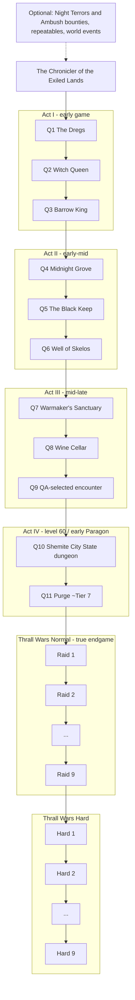

# Chronicler Campaign V1 — admin-configured PvE progression

Status: **DESIGN ONLY.** Nothing in this campaign is built in-game or tested in-game, and writing this document changed nothing on the server.
- Separately, Modpack V1 Batch A (StackMe10K, Savage Paragon, Grit & Grease) was installed on `D:\conan exiles\depot_443031` and passed (`2aca0cf`). That ran in another session, at the operator's direction.
- **Environment (operator decision, 2026-10-02):**
  - `depot_443031` is **STAGING / PRE-PRODUCTION**, and its world is a **TEST / VALIDATION** world. Its `game_0.db` is not production data.
  - **The production save is not created yet.** It is created and frozen only after all of these:
    1. all target mods validated
    2. final load order accepted
    3. backup/restore verified
    4. campaign systems accepted
    5. explicit user approval to start the real campaign
- Only one session commits or pushes at a time.

Blocking everything in-game:
- **No authenticated admin client.** 4F is blocked by client authentication (see `STATUS.md`). Quest NPCs, CharVars, triggers and boss tests all need one.
- **Two `.pak` files are missing:** Tot ! Enhanced Sudo and Thrall Wars Utilities. Workshop download is blocked on this network.
  - Thirteen are local in `C:\Users\vkkha\Downloads\mod conan` (checked 2026-10-02): all ten V1 mods, plus `NightTerrors.pak`, `PvEPlusAmbush.pak` and `SlaveWarsServer.pak`.
  - Each matches its Workshop item size to the byte. Size is a version hint only.
  - `SlaveWarsServer.pak` is the Thrall Wars Dungeon Mod: 466,505,066 B, internal mod roots `SlaveWars…` (Thrall Wars' original name).

Evidence labels used below:

| Label | Meaning |
| --- | --- |
| VERIFIED | Checked on this host, or public Steam metadata, on 2026-10-02 |
| AUTHOR | The mod author's description; not verified here |
| UNVERIFIED | Must be proven on staging before anything depends on it |
| NOT RUN | QA has not happened |

## 1. Decisions (operator, 2026-10-02)

- **"Twelve Legends" is removed from the plan.** A search found no trace of it on this host:
  - this repository: every branch and the full history
  - `D:\conan exiles` (including the server's `Saved` folder)
  - the user folders
  - other Claude Code sessions
  - a drive sweep for DevKit / `.uproject` folders

  Nothing was deleted, because there was nothing to delete. If it exists elsewhere (another machine, a chat, a DevKit project), it is superseded by this document.
- **No Conan DevKit project.** Everything is built from mod-provided tools:
  - Thrall Wars Utilities (TWU): quest/script builder, Utility NPC, triggers, zones, doors, portals, reward boxes, merchants
  - Tot ! Enhanced Sudo: CharVars / GlobVars and the admin panel
  - Thrall Wars Dungeon Mod placeables (raid bosses, recipe journals, doors)
  - each mod's admin menu

  No custom NPC systems.
- **One quest hub NPC:** "The Chronicler of the Exiled Lands".
- **Normal thralls stay support units.** There is no global thrall buff. Authority builds stay viable through per-character sources (section 4.3).
- **Exploration stays open.** Progression is gated, the map is not walled off (section 9).
- **All building and QA happen on staging** (`depot_443031`, a test world). The production world is created only after the acceptance criteria in the status block and explicit user approval (sections 10, 11.5 and 12).

## 2. Final modlist (15)

Interpretation (flag it if wrong): the three "content mods to keep" and the two quest-infrastructure mods are **added to** the ten Modpack V1 mods; they do not replace any of them. Quest 10 needs Shemite City State, and the reward plan uses Savage Paragon, Grit & Grease and Thrall Reputation.

Metadata, per-mod notes and the conflict matrix are in `MODPACK_V1.md`.

| # | Mod | Workshop ID | Role | Batch |
| --- | --- | --- | --- | --- |
| 1 | Thrall Reputation | 3787066846 | Follower reputation buff | B |
| 2 | Savage Paragon | 3766043945 | Post-60 progression (Authority tree) | A |
| 3 | Ancient Realms Enhanced (WIP) | 3755775098 | Building | C |
| 4 | Improved Thralls & QoL | 3758661389 | QoL; per-thrall-type stat modifiers (off) | B |
| 5 | Fantasy Races Of Exiles | 3780741325 | NPC spawns | D1 |
| 6 | [Enhanced] WO - Riding Thralls | 3803149679 | Follower mounts | B |
| 7 | Shemite City State: Enhanced | 3755371705 | Map + dungeon (Quest 10) | D3 |
| 8 | Cannibal Captivity (Enhanced) | 3765743138 | Camp content | D2 |
| 9 | Grit & Grease (Weapon Infusions) | 3801774752 | Weapon infusions | A |
| 10 | StackMe10K | Nexus mod 3 | Stack size | A |
| 11 | **Tot ! Enhanced Sudo** | 3721090132 | CharVars / GlobVars, permissions, admin panel | E |
| 12 | **Thrall Wars Utilities** | 3721224296 | Quest builder, Utility NPC, triggers, gates | E |
| 13 | **Night Terrors** | 3723538551 | Optional dynamic night encounters | F1 |
| 14 | **PvE Plus Ambush (Enhanced)** | 3721274811 | Optional dynamic ambushes | F1 |
| 15 | **Thrall Wars Dungeon Mod** | 3722829382 | 9 raid bosses (Normal/Hard), gear, gems | F2 |

## 3. Load order — PROPOSED, not declared

Project rule (`MODPACK_V1.md`): the final order is declared only after **all fifteen** are tested together with runtime evidence (mount sequence, IoStore `Order=`). Until then, this is the starting order for the Review step. Top = mounted first.

Runtime evidence so far (Batch A, `2aca0cf`):
- The mount sequence and the IoStore container `Order` follow `modlist.txt` (first entry 1000, then +1): **PROVEN**.
- Which mod wins an asset that two mods override was **not observed**. "Later entry wins" is Unreal's documented behaviour for a higher `Order`, and it needs a real two-mod overlap to confirm.

Hard constraints (author-stated):

| Constraint | Source |
| --- | --- |
| Sudo goes at the **bottom** of the modlist, so mods that accidentally pack outdated Sudo API files cannot override it | Sudo docs (`apiconan.totchinuko.fr/#/modlist`) |
| TWU **requires** Sudo (it uses Sudo's CharVar manager) | Workshop "Required items" on the TWU page: VERIFIED |
| Savage Paragon loads after any XP mod. ITQoL has party shared XP and inactive follower XP, so Paragon goes after ITQoL | Paragon author; MODPACK_V1 |

Proposed order:

| Pos | Mod | Why here |
| --- | --- | --- |
| 1 | Shemite City State | Map mod; base-map changes first |
| 2 | Cannibal Captivity | Map-area content (3F) |
| 3 | Ancient Realms Enhanced | Building set |
| 4 | Fantasy Races Of Exiles | Spawn tables after the map mods; the Shemite `Gameplay_NPCs_Desert_West` overlap is a test item |
| 5 | Thrall Wars Dungeon Mod | Large content mod; its own item ID ranges |
| 6 | Night Terrors | Adds to tables only ("replaces no data", AUTHOR) |
| 7 | PvE Plus Ambush | Dynamic spawner |
| 8 | Grit & Grease | Weapon infusions |
| 9 | Riding Thralls | Follower mounts |
| 10 | Improved Thralls & QoL | Follower/QoL systems (XP-related) |
| 11 | Thrall Reputation | Follower buff UI |
| 12 | Savage Paragon | After the XP-related mods |
| 13 | StackMe10K | ItemTable patch late, so it wins over earlier item edits (whether it covers modded items is UNVERIFIED) |
| 14 | Thrall Wars Utilities | Above Sudo; depends on it |
| 15 | Tot ! Enhanced Sudo | Bottom, per author |

Load-order failure signature from the Sudo docs, to grep in every boot log: `Failed to find function ... in Tot_CommonLibrary_C`. It means an outdated Sudo API file is overriding the current one; fix it by reordering.

## 4. Server configuration

### 4.1 Values

Applied on **staging** first (section 10). The staging file currently has vanilla values, so "keep" means "adopt as the campaign baseline". Values were read on 2026-10-02 from `depot_443031\ConanSandbox\Saved\Config\WindowsServer\ServerSettings.ini`.

| Key | Staging now | Campaign | Note |
| --- | --- | --- | --- |
| `PlayerDamageMultiplier` | 1 | **0.800000** | |
| `PlayerDamageTakenMultiplier` | 1 | **1.150000** | |
| `NPCDamageMultiplier` | 1 | **1.350000** | |
| `NPCDamageTakenMultiplier` | 1 | **0.650000** | |
| `StaminaCostMultiplier` | (absent) | **1.150000** | Key name UNVERIFIED (see 4.2) |
| `ThrallDamageToNPCsMultiplier` | 0.5 | **0.300000** | |
| `MinionDamageMultiplier` | 1 | 1 (unchanged) | No global thrall buff |
| `MinionDamageTakenMultiplier` | 1 | 1 (unchanged) | No global thrall buff |

```ini
; Campaign V1 delta, staging first. Edit with the server Offline, after a verified cold backup.
[ServerSettings]
PlayerDamageMultiplier=0.800000
PlayerDamageTakenMultiplier=1.150000
NPCDamageMultiplier=1.350000
NPCDamageTakenMultiplier=0.650000
PlayerStaminaCostMultiplier=1.150000   ; see 4.2: the server writes this key, not StaminaCostMultiplier
ThrallDamageToNPCsMultiplier=0.300000
```

### 4.2 Stamina key: must be proven

- The server-written `ServerSettings.ini` contains `PlayerStaminaCostMultiplier=1` and `PlayerStaminaCostSprintMultiplier=1`. It has **no** `StaminaCostMultiplier` line.
- The server binary does contain the string `StaminaCostMultiplier`, so the key may still be read. That is not proven.

QA procedure on staging:
1. Record the stamina cost of fixed actions with vanilla values: one heavy attack with a named weapon, one dodge, 10 s of sprint.
2. Set `PlayerStaminaCostMultiplier=1.15` and re-measure.
3. Revert it, set `StaminaCostMultiplier=1.15` alone, and re-measure.
4. Keep **only** the key that produces +15%.

Never set both: if both apply, the result would be about +32%.

### 4.3 What the multipliers do together (UNVERIFIED arithmetic)

If the multipliers stack multiplicatively (QA measures this; it is not proven):

| Interaction | Formula | vs vanilla |
| --- | --- | --- |
| Player → NPC damage | 0.80 × 0.65 | **0.52×**; NPCs take about 1.9× as long to kill |
| NPC → player damage | 1.35 × 1.15 | **1.55×** |
| Thrall → NPC damage | 0.30 × 0.65 | **0.195×** if `NPCDamageTakenMultiplier` also applies to thrall damage, otherwise 0.30× |
| NPC → thrall damage | 1.35 × 1 | 1.35× if `NPCDamageMultiplier` applies to thralls |

Consequences the design must respect:

1. **"Dangerous, not damage sponges."** The global values already make every NPC about 1.9× tankier for players. Boss HP must not be raised on top. If QA measures sponge-length fights, that is a server-wide finding for the operator; it is not compensated with boss HP.
2. **The Authority role is under pressure.** An elite thrall keeps 0.195–0.30× of its vanilla output, while players keep 0.52×. A global thrall buff is ruled out. Per-character or per-thrall-type levers, in order of preference:
   1. vanilla Authority attribute perks
   2. the Savage Paragon Authority tree (per character)
   3. gear
   4. last resort, with an operator decision: ITQoL "Individual Thrall Base Stat Modifiers" on the specific elite thrall types only (for example Thrall Wars Tier-4 named thralls). This is still global per thrall *type*, and ITQoL modifiers are OFF under the V1 rule until this balance test.

   `ThrallDamageToNPCsMultiplier` is never raised to rescue the Authority role.
   - Thrall Reputation's "Friends with Benefits" buffs the **player**, not the thrall. It helps the Commander, not the elite thrall.
3. **Dynamic encounters get the same multipliers.** Night Terrors (level 10+) and PvE Plus Ambush (level 9+) spawn NPCs that deal 1.55× and take 1.9× as long to kill. Solo players at levels 10–20 are the most exposed (QA test D-1).

### 4.4 Difficulty rubric (target 8/10)

| Score | Meaning, for the main composition C1 |
| --- | --- |
| 6 | Comfortable. Wipes are rare even when mechanics are ignored. |
| 7 | Needs attention. Occasional deaths, first-try clears are common. |
| **8 (target)** | A group that ignores mechanics usually fails. A group that respects them clears in 1–3 attempts. At least one mechanic heavily punishes face-tanking, stamina waste or poor positioning. There are no unavoidable one-shots. The fight lasts long enough to see every mechanic at least twice. |
| 9 | Multiple wipes even when coordinated; tight margins. |
| 10 | Needs near-perfect execution or optimized gear. |

Fight-length proposal, to be tuned by QA, for C1:

| Stage | Duration |
| --- | --- |
| Act I | 1.5–4 min |
| Acts II–III | 3–6 min |
| Act IV | 4–8 min |
| Thrall Wars Normal | 5–10 min |
| Thrall Wars Hard | 7–12 min |

A fight lasting more than about 2× "every mechanic seen twice" counts as a sponge.

## 5. Quest flow



### 5.1 The Chronicler

The Chronicler is a TWU **Utility NPC** at one hub, chosen by the admin. It should be safe, reachable early, and outside any raid area. It:
- introduces each chapter (draft texts in the appendix)
- gives the next objective in the TWU **Quest Log**
- pays rewards on turn-in, through a TWU reward box or merchant
- runs the optional bounty exchange (section 7)

There is one hub NPC. Rewards may also come from TWU reward boxes placed by the admin.

### 5.2 Main quests

Community level and boss names come from a community guide (conanfanatics.com dungeon order guide), not from this server. QA records the real in-game names and measured difficulty.

| Quest | Objective | Guide level / final boss | Prerequisite | Completion var |
| --- | --- | --- | --- | --- |
| Q1 | The Dregs: final boss | 20 / "Abysmal Remnant" (spec says "Abyssal Remnant"; QA confirms) | none | `CL_Q01` |
| Q2 | Palace of the Witch Queen: Witch Queen | 30 / Witch Queen | `CL_Q01=1` | `CL_Q02` |
| Q3 | The Barrow King: final boss | 40 | `CL_Q02=1` | `CL_Q03` → **Act II** |
| Q4 | Midnight Grove: final boss | 55 | `CL_Q03=1` | `CL_Q04` |
| Q5 | The Black Keep: final boss | 60 / Kinscourge | `CL_Q04=1` | `CL_Q05` |
| Q6 | Well of Skelos: final boss | 60 | `CL_Q05=1` | `CL_Q06` → **Act III** |
| Q7 | Warmaker's Sanctuary: final boss | 60 / Arena Champion | `CL_Q06=1` | `CL_Q07` |
| Q8 | The Wine Cellar: final boss | 60 | `CL_Q07=1` | `CL_Q08` |
| Q9 | QA-selected high-level vanilla encounter (5.3) | QA | `CL_Q08=1` | `CL_Q09` → **Act IV** |
| Q10 | Shemite City State: principal dungeon / milestone | mod content; QA | `CL_Q09=1` | `CL_Q10` |
| Q11 | Purge milestone, about Tier 7 (adjusted after testing) | QA | `CL_Q10=1` | `CL_Q11` → **Thrall Wars Normal** |

Design flags. The order is unchanged; each is an operator decision after QA:
- **Act II labels.** Guides place Black Keep and Well of Skelos at level 60, so "early-mid" may be optimistic, especially with 1.55× / 0.52×. QA confirms each act's real level band.
- **Q7 → Q8 order.** Guides rate Warmaker's Sanctuary as the hardest vanilla dungeon, harder than the Wine Cellar. If QA agrees, swapping Q7 and Q8 keeps the curve rising.
- **Q11 timing.** A Purge that only fires on its own meter has the same "waiting on randomness" problem that keeps Night Terrors out of the main path. QA confirms the tier scale in this build, and whether an admin can start a Purge on demand. If not, Q11 runs as a scheduled "purge night" with an admin present.
- **Optional side dungeons** (Scorpion Den about 45, Sunken City about 50) fit between Acts I and II as side content, never as gates.

### 5.3 Quest 9 selection (QA)

Do not choose by theoretical level. Shortlist, which QA may extend:
- the White Dragon (Frozen North; a legendary boss)
- other triple-skull legendary world bosses
- Temple of Frost

Kinscourge (Q5) and Arena Champion (Q7) are already used.

Selection criteria, all measured with the real multipliers and the current modpack:
1. C1 rates it 8/10, and it is a measurable step above Q8 (time, deaths, attempts), not a cliff.
2. It has a fixed location and does not depend on a random spawn.
3. Completion can be credited to the party (section 6.2).
4. Its loot does not skip the Act IV reward tier.

### 5.4 Thrall Wars raids

- **Unlocks:** Normal Mode at `CL_Q11=1`. Hard Mode at `TW_N_01..09` all = 1.
- **Rank by testing.** QA tests all nine bosses (section 11.3) and ranks them easiest → hardest by **actual server testing**. The internal asset/list order is **not** the progression order.
- **Raid Quest k** = rank k. `TW_N_0k` is the rank index, not the asset index.
- **Only the next raid awards campaign progression.** Raid k completes only when `TW_N_0(k-1)=1` (or `CL_Q11=1` for k=1).
- **Repeats** of earlier raids give the boss's normal loot only, if the mod permits.
- **Hard Mode** uses the same rank order, sequentially: Hard k needs `TW_H_0(k-1)=1`, and Hard 1 needs all `TW_N`.

Legacy (UE4) change notes mention these boss names: Heng and Neesa (a two-boss group encounter), Kylikky, Ikkily, Torgrimur Skald, Arbanus, Gyas and Jorgrim (Thyri). They are UNVERIFIED for the Enhanced version and must not be used for ordering.

## 6. Progress tracking and party credit

### 6.1 Rules

- **Storage.** Progress lives in Sudo **CharVars**: numeric 0/1, per character, set by TWU quest/script actions. A player with two characters progresses twice ("per player where practical").
- **Completion.** A completion var is set only when its prerequisite var is 1 **and** its own var is still 0. This blocks sequence skipping and double completion.
- **Reward claim.** Rewards are claimed at the Chronicler, which sets a separate `_RC` var. A character can be "completed but unclaimed" without risk, and an admin can re-grant safely.
- **Credit is not tied to the killing blow.** Credit goes to every eligible character who **participated**.
- **Participation** means present in the encounter when the boss dies. How that is detected depends on the method below.
- **Kill switch.** GlobVar `CL_CAMPAIGN_ON` disables every campaign trigger when it is 0, for building, maintenance and rollback.

### 6.2 Party credit methods

Implement the first method that QA proves on staging. Record the method used for each quest.

| Method | How | Works for | Status |
| --- | --- | --- | --- |
| **A. Kill-triggered zone** | Boss death enables a TWU Interaction/Utility Zone, or a claim object, for T minutes (proposal: 5). Each character inside it, or interacting with it, gets the var if eligible. | Thrall Wars bosses placed through TW/TWU spawners, if a death can fire a TWU trigger | UNVERIFIED |
| **B. Trophy hand-in** | Each participant brings a boss-specific item to the Chronicler. QA must find a drop that **every** participant can obtain. | Vanilla bosses, if such a drop exists | UNVERIFIED |
| **C. Admin witness** | An admin, or a Sudo-permission moderator if delegation works, sets the CharVars in the Sudo admin panel (`Shift+U` / `datacmd sudoexile`) after a witnessed kill | Everything; always available | Sudo panel AUTHOR; delegation UNVERIFIED |

Known weaknesses:
- **B:** items can be passed to someone who was not there. This is acceptable for about 5 trusted friends.
- **C:** manual, but always available as a fallback.

## 7. Optional content: Night Terrors and PvE Plus Ambush

Neither mod is a main-quest gate. Both are dynamic, and Night Terrors is random and rare at the high tiers. No main-campaign var depends on them.

| ID | Activity | Mechanism | Var | Reward |
| --- | --- | --- | --- | --- |
| NT-1 | "Sigil of the Pale Mother": first Sigil of Minevra turned in (dropped by Night Terrors demons, AUTHOR) | Chronicler item turn-in | `OPT_NT_01` | Lore page plus small consumables, once |
| NT-2 | Bounty: demon bones and essences | Chronicler merchant exchange, repeatable | none | Consumables and repair materials |
| NT-3 | Night Terrors world event | Admin-scheduled, at night, outside claims; credit by method A/C if proven | `OPT_EVT_xx` (optional) | Consumables, cosmetics |
| AMB-1 | Ambush survival | Repeatable; no reliable completion signal is known | none | The ambush loot itself |
| AMB-2 | Hub siege world event | Admin-run TWU spawner event | `OPT_EVT_xx` (optional) | Consumables |

Rules:
- Rewards are consumables, materials or lore only. Never campaign progression.
- Players may opt out with Night Terrors plushies (crafted at religious altars; disable ambushes for that player, AUTHOR).
- Night Terrors grants **native power outside campaign gating**. Corrupted Valkyrie thralls (AUTHOR stats) have melee 2.709 vs the Cimmerian Berserker's 2.24, and Kinarra has 2.9025. They are available from level 10. Aleatha crafts hellforged/blighted weapons. Lesser Valkyries can be summoned from a T3 Ymir altar. QA must check these against the reward curve (test D-2). Levers: `dc nightterrors admin`.

## 8. Variable list

All are Sudo CharVars, numeric 0/1, unless noted.

| Variable | Set by | Meaning |
| --- | --- | --- |
| `CL_Q01` … `CL_Q11` | Completion mechanism (6.2) | Main quest n completed |
| `CL_Q01_RC` … `CL_Q11_RC` | Chronicler turn-in | Main quest n reward claimed |
| `TW_N_01` … `TW_N_09` | Raid completion (6.2) | Normal raid of **rank** k completed |
| `TW_N_01_RC` … `TW_N_09_RC` | Chronicler turn-in | Campaign reward for Normal rank k claimed |
| `TW_H_01` … `TW_H_09` | Raid completion | Hard raid of rank k completed |
| `TW_H_01_RC` … `TW_H_09_RC` | Chronicler turn-in | Campaign reward for Hard rank k claimed |
| `OPT_NT_01` | Chronicler turn-in | First Sigil of Minevra turned in |
| `OPT_EVT_xx` | World event (optional) | Event participation, if used |
| GlobVar `CL_CAMPAIGN_ON` | Admin (TWU Global Variable Lever or Sudo panel) | 1 = campaign triggers active |
| GlobVar `CL_SCHEMA` | Admin | Variable-scheme version; 1 for this document |

Derived gates use no extra variables, which prevents them from drifting out of sync:

| Gate | Condition |
| --- | --- |
| Act II | `CL_Q03=1` |
| Act III | `CL_Q06=1` |
| Act IV | `CL_Q09=1` |
| Thrall Wars Normal, Raid 1 | `CL_Q11=1` |
| Normal raid k>1 | `TW_N_0(k-1)=1` |
| Hard Mode, Hard 1 | `TW_N_01..TW_N_09` **all** = 1. Check all nine, not just `TW_N_09`, so an admin edit cannot open it early. |
| Hard raid k>1 | `TW_H_0(k-1)=1` |

Raid rank mapping, filled in by QA:

| Rank k | Normal var | Hard var | Boss (Enhanced in-game name) | Internal list position | Status |
| --- | --- | --- | --- | --- | --- |
| 1 | `TW_N_01` | `TW_H_01` | (QA) | (QA) | NOT RUN |
| 2 | `TW_N_02` | `TW_H_02` | (QA) | (QA) | NOT RUN |
| 3 | `TW_N_03` | `TW_H_03` | (QA) | (QA) | NOT RUN |
| 4 | `TW_N_04` | `TW_H_04` | (QA) | (QA) | NOT RUN |
| 5 | `TW_N_05` | `TW_H_05` | (QA) | (QA) | NOT RUN |
| 6 | `TW_N_06` | `TW_H_06` | (QA) | (QA) | NOT RUN |
| 7 | `TW_N_07` | `TW_H_07` | (QA) | (QA) | NOT RUN |
| 8 | `TW_N_08` | `TW_H_08` | (QA) | (QA) | NOT RUN |
| 9 | `TW_N_09` | `TW_H_09` | (QA) | (QA) | NOT RUN |

## 9. Progression gates and rewards

### 9.1 What is gated, and how

The map stays open. A player who finds a late location early may explore it and keep **vanilla** loot; that cannot be gated without DevKit. They do not get campaign or Thrall Wars progression rewards early.

| Gated item | Mechanism (preference order) | Status |
| --- | --- | --- |
| Quest chapters | Chronicler conditions on CharVars | UNVERIFIED (TWU conditions) |
| Raid entrances | 1) TWU Utility door or TW advanced door that checks a CharVar; 2) TWU Transport Portal with a condition; 3) a raid key item from the Chronicler (tradeable, so weaker) | UNVERIFIED |
| Raid arenas | TW bosses are admin-placed, so put each arena in an enclosed space behind its gate. Use a TWU Climbing blocker zone where needed. | design |
| Major recipes | TW recipe journals placed behind gates, or given at turn-in | AUTHOR |
| Special merchants | TWU merchant / social merchant visible only at a progress level | UNVERIFIED |
| Strongest gear | Hard-mode raid loot and Hard turn-ins only | design |
| Gems (TW gem system) | Gem sources only from TW Normal (basic) and Hard (top) | design |
| Hard Mode | Section 8 gate | design |
| Final rewards | `TW_H_09` turn-in | design |

Gate-bypass risks QA must test (test G-1):
- **Teleports.** The ITQoL portal spell (ITQoL is default-off; keep its sorcery features off), the TWU Warp system / Transport Portal, and vanilla map rooms or obelisks.
- **Thrall Wars lockpicking** against gated doors.
- **Building or climbing** over arena walls (`AllowBuildingAnywhere=False` on staging).

ITQoL item and feat bans are server-wide, not per player, so they are **not** a progression tool.

### 9.2 Reward table

Principles:
- Gradual.
- No single item may invalidate vanilla legendary progression.
- Remember what already stacks on this server: Savage Paragon crit nodes (Evisceration +15% crit chance, crits +50%), Grit & Grease elemental infusions (a % of weapon damage) and the Thrall Wars critical rating / critical damage system. QA compares **effective** damage including crit and infusions, not only base stats.

| Stage | Main rewards | Examples (from the installed mods / vanilla) | Hard caps |
| --- | --- | --- | --- |
| Act I (Q1–Q3) | Useful supplies, consumables, repair materials, moderate XP, lore | Food, drink, healing items, repair materials, TWU lore-book pages. XP only if a TWU reward action supports it (UNVERIFIED); never admin level commands. | **No endgame weapons.** No gear above what is craftable at the act's level band. |
| Act II (Q4–Q6) | Supplies, moderate gear and recipes | Grit & Grease resin materials (alchemy bench, level 10+), moderate armor/weapon pieces | No legendary-tier weapon |
| Act III (Q7–Q9) | Better recipes, unique progression rewards | Higher-tier vanilla materials, unique cosmetics or titles, lore | No Thrall Wars raid gear |
| Act IV (Q10–Q11) | Unique progression rewards, raid preparation | Potion of Paragon Memory (Savage Paragon respec), raid entry for Raid 1 | Raid access only, not raid gear |
| TW Normal (Raid 1–9) | Raid equipment, first advanced systems | Basic TW armor/weapons, basic gems, basic TW recipe journals | Proposal: a TW Normal item's effective DPS / mitigation is at most +10% over the best vanilla legendary of that slot |
| TW Hard (Hard 1–9) | Strongest raid rewards | Legendary TW versions, top gems, final rewards | Proposal: at most +20% over vanilla legendary; final rewards only at `TW_H_09` |

Quantities are tuned on staging. Each turn-in pays once (`_RC` var). Repeat clears give only the boss's own loot.

## 10. Admin setup (on staging)

### 10.1 Prerequisites

- An authenticated Conan client with admin rights. **Currently blocked (4F).**
- `.pak` files for all fifteen mods, imported through the app's Local mod pipeline per the `MODPACK_V1.md` batch plan (A → F2, cumulative).
- **Staging is the test instance.** `D:\conan exiles\depot_443031` holds a test/validation world, so no separate copy is needed for building and QA.
- **Optional disposable copy**, for destructive drills only (for example a rollback rehearsal you would rather not run on the staging world):
  1. Copy the staging install (4.2 GB) to the guarded workspace default `E:\CSC-M3-Live\server` (currently empty; E: has 414 GB free).
  2. Restore a **copy** of a verified staging backup into its `ConanSandbox\Saved`.
  3. The live harness uses `<root>\server` when `CSC_SERVER_DIR` is not set.
  4. Never run both servers at once; the harness refuses to start while another Conan server process exists.

### 10.2 Admin commands (from the mod descriptions; AUTHOR)

| Mod | Command / key |
| --- | --- |
| Sudo | Admin panel `Shift+U` or `datacmd sudoexile`; user settings `Shift+Alt+U` or `datacmd clientconfig` |
| Thrall Wars Utilities | Placeable items in admin mode; the docs are on the TW Discord (UNVERIFIED how the builder opens) |
| Thrall Wars Dungeon | `Shift+T` (attachables, gem system, Settings → About); `Shift+N` (dice) |
| Night Terrors | `dc nightterrors admin` |
| PvE Plus Ambush | `DataCMD PvEAmbushConfig`. Changes apply only after the **next** ambush rotation. Enhanced disables the Insert console key; the client fix is `ConsoleKeys=Insert` under `[/Script/Engine.InputSettings]` in the client `Input.ini`. |
| Improved Thralls & QoL | `DataCmd ImprovedThrallsQoL` |
| Fantasy Races Of Exiles | `dc FROESettings` |
| Savage Paragon | Admin commands per the author's pinned guide |

### 10.3 Steps

Each step has a verification, and a failed verification stops the plan.

| # | Step | Verify |
| --- | --- | --- |
| 1 | Staging baseline (10.1) | Offline, verified cold backup, `quick_check` = ok |
| 2 | Install batches A → F2 on staging (Batch A PASS, `2aca0cf`) | Every per-batch gate in `MODPACK_V1.md` |
| 3 | Apply the 4.1 delta with the server Offline, after a cold backup | File hash recorded; the 4.2 stamina measurement |
| 4 | ITQoL: confirm everything is still default-off (V1 rules) | In-game settings screenshot |
| 5 | Dynamic mods, starting values. PvE Ambush: min time between ambushes 2700 s, extra 1800 s, despawner on, despawn 600 s. Night Terrors: defaults, recorded. | Values recorded; D-1 test |
| 6 | Sudo: set GlobVars `CL_CAMPAIGN_ON=0`, `CL_SCHEMA=1`; leave permissions admin-only | Sudo panel shows them |
| 7 | Place the Chronicler (TWU Utility NPC) and the chapter dialogue (appendix); Quest Log entries Q1–Q11 | A fresh character sees only Q1 |
| 8 | Build the completion mechanism for each quest (6.2) and record the method | Test P-1/P-2 |
| 9 | Place Thrall Wars bosses in enclosed arenas behind gates (9.1) | Test G-1 |
| 10 | Rewards: reward boxes and merchant stock per 9.2 | Test R-1 |
| 11 | Set `CL_CAMPAIGN_ON=1`; run QA (section 11) | QA sign-off |
| 12 | Write the build sheet: every NPC, trigger, zone, door, condition and reward, with its location and settings | Reviewed by QA |
| 13 | Create the production world (11.5), only with explicit user approval | |

### 10.4 Carrying the campaign build into the production world

The production world does not exist yet. It will be a **new** world. The staging world is never promoted, because it holds test characters, test items and test vars. The campaign build reaches the new world as follows:
1. **Export/import, only if proven.**
   - Sudo's description (AUTHOR) mentions a one-click server export for mods that implement its backup interface.
   - Use it only if TWU, and every other mod holding campaign content, is shown on staging to export and re-import correctly.
   - Until then, **no migration capability is claimed** (UNVERIFIED).
2. **Otherwise, rebuild from the build sheet** (step 12) in the new world, then rerun the smoke tests.

## 11. QA

### 11.1 Compositions

| ID | Composition | Use |
| --- | --- | --- |
| **C1** | **4 combat players + 1 Authority Commander** with one elite thrall | **Primary tuning target** |
| C2 | Solo (one normal support thrall allowed) | Acts I–II expectations; raids recorded only |
| C3 | 3-player party | |
| C4 | 5 combat players, no thralls | Player baseline |
| C5 | 5 players, each with one ordinary support thrall | |
| — | 5 fully optimized combat thralls | **Never a tuning target** |

**Authority viability criterion (proposal):** C1's clear time and deaths are within about 20% of C4's, and the elite thrall provides most of the Commander's contribution.

### 11.2 Tests per stage

| ID | Test | Pass |
| --- | --- | --- |
| S-1 | Server-side gates for every batch (`MODPACK_V1.md`) | All gates |
| K-1 | Stamina key (4.2) | Exactly +15% from exactly one key |
| K-2 | Multiplier arithmetic (4.3): damage to and from a fixed NPC by a player and by a thrall, vanilla vs campaign values | The effective factors measured and recorded |
| P-1 | Sequence: completing Q(n) without Q(n-1) gives nothing; a repeat gives nothing | Vars unchanged |
| P-2 | Party credit: 3 characters participate and one lands the kill; all 3 are credited; a character absent from the encounter is not | Per method |
| R-1 | Each reward is claimed once; a second claim is refused; caps (9.2) are met | |
| G-1 | Gate bypass: teleports, lockpicks, climbing/building, raid keys traded to an ineligible character | No progression reward reachable early |
| D-1 | Dynamic encounters, solo at levels 10–20, at night, with Ambush and Night Terrors active together | Survivable with care; values recorded |
| D-2 | Night Terrors' native power (valkyrie thralls, hellforged/blighted weapons) vs the reward curve | Operator decision recorded |
| B-1 | Every campaign boss (Q1–Q11) in C1, plus C2/C3/C4/C5 where relevant | 8/10 by the rubric; durations recorded |
| B-2 | Q9 selection (5.3) | Chosen encounter plus evidence |
| T-1 | All nine Thrall Wars bosses, Normal (11.3) | Ranked table |
| T-2 | All nine Hard | Ranked table |
| X-1 | Night Terrors inside dungeons: run each boss with Night Terrors suppressed (plushie or admin setting) **and** with it on | Both recorded; tuning uses the suppressed run |

### 11.3 Thrall Wars boss record (one per boss, Normal and Hard)

| Field | Value |
| --- | --- |
| Name (in-game) | |
| Internal list position | |
| HP (mod data or admin inspection; if unavailable, "unknown" plus measured time to kill) | |
| Important mechanics | |
| Major damage attacks (approximate damage vs the C1 tank) | |
| Adds (type, count, timing) | |
| Control effects (stun, knockdown, root, pull) | |
| Difficulty, 5 players (C4) | /10 |
| Difficulty, 4 + Authority Commander (C1) | /10 |
| Difficulty, C2 / C3 / C5 | /10 |
| Approximate fight duration (C1) | |
| Deaths by cause (mechanic, stamina, positioning, face-tank) | |
| Rewards (native loot) | |
| Night Terrors suppressed / on | |
| Tester, date, server build, modlist hash | |

### 11.4 QA results

**No in-game QA has been run.** Every in-game item in 11.2 is NOT RUN, blocked by 4F (no authenticated client) and by the missing Sudo and TWU `.pak` files.

Desk checks done in this session (2026-10-02):

| Check | Result |
| --- | --- |
| "Twelve Legends" anywhere on this host (repo, all branches and history, server, user folders, other sessions, DevKit sweep) | **Not found.** Nothing to remove. |
| Steam `GetPublishedFileDetails` for 3723538551, 3721274811, 3722829382, 3721090132, 3721224296 | All `result=1` (public, not banned) |
| TWU "Required items" | **Tot ! Enhanced Sudo (3721090132)**. VERIFIED. |
| Thrall Wars Dungeon "Required items" | Not visible: the page is behind Steam's mature-content gate. The description lists no dependency. |
| Hidden "incompatible / removed" notices on the pages | `display: none` templates; they do not apply (same as V1) |
| Staging `ServerSettings.ini` | Vanilla damage values; `ThrallDamageToNPCsMultiplier=0.5`; no `StaminaCostMultiplier` line |
| Backup/restore scope (code) | A backup holds the world, `Saved\Config` and `modlist.txt`. A restore puts those back. **It does not restore `.pak` files.** |

### 11.5 Production world creation checklist

Preconditions (operator decision, 2026-10-02):
1. All target mods validated: every S, K, P, R, G, D, B and T test passed, or has an operator-accepted exception.
2. Final load order accepted, from the Review evidence.
3. Backup/restore verified: the R0, R2 and R3 rollback drill passed on staging.
4. Campaign systems accepted: build sheet reviewed, QA signed off.
5. **Explicit user approval to start the real campaign.**

Creation, only after all five:
1. Create the new world with the same `.pak` SHA-256 values, imported through the Local pipeline, and the declared `modlist.txt`.
2. Apply the config delta.
3. Build the campaign (10.4) and set `CL_CAMPAIGN_ON=1`.
4. Smoke test: a fresh character sees Q1; the admin-witness path works; the server stops cleanly.
5. Take a verified cold backup. It is the production baseline, and the world is now frozen as production.

## 12. Rollback procedure

This applies to staging now, and to production once it exists.

| Level | Trigger | Action |
| --- | --- | --- |
| R0 Pause | A campaign bug, wrong credit, a gate bypass | Set GlobVar `CL_CAMPAIGN_ON=0`. Triggers stop; the world is untouched. |
| R1 Fix vars | Wrong CharVars on a few characters | Sudo admin panel: set the affected vars back. Record who, what and why. |
| R2 Config | Balance disaster from 4.1 | Server Offline → copy back the pre-change `ServerSettings.ini` (in every cold backup's `config\`) → boot → verify |
| R3 Mod or campaign | Boot failure, missing-mod errors, a crash loop, Sudo-signature errors | Restore the **pre-change verified cold backup** through the app. It restores the world, `Saved\Config` and `modlist.txt` together. See the notes below. |
| R4 Full | Data damage (`quick_check` fails, wipes) | R3 from the last good backup. Accept the loss of progress since then and tell the players the backup timestamp. |

Notes for R3 and R4:
- **A restore does not touch `.pak` files.** Mods added after the backup stay in `Mods\` but are inert, because the restored `modlist.txt` no longer lists them. Mods removed after the backup are in the app's `removed-mods` archive: re-import them through the Local pipeline.
- **Reconcile the app's mod catalog** with the restored `modlist.txt`. It is not restored with the backup (UNVERIFIED; check after the first rollback drill).
- **Never remove a content mod from a world in use without restoring a pre-install backup.** Removing Night Terrors deletes its weapons and valkyries (AUTHOR). Removing Thrall Wars removes its items and placeables. Removing Shemite or Ancient Realms breaks placed pieces.
- Quest state is probably stored in the world database, so restoring it also rolls back CharVars (UNVERIFIED).
- **Rollback drill:** run R0, R2 and R3 on staging (or the optional disposable copy) before the production world is created. This is precondition 3 in 11.5.

## 13. Known issues and risks

1. **In-game work is blocked.** There is no authenticated client (4F). The Chronicler, CharVars, triggers, boss QA and the stamina test cannot be done from this host.
2. **Missing `.pak` files.** Sudo and Thrall Wars Utilities are missing, and Batch E cannot start without them. Workshop download is blocked on this network (Valve Fastly CDN). The other thirteen are local.
3. **TWU capabilities are unverified.** Its docs are on Discord only. Per-character conditions, death triggers, party credit, XP rewards and export are all UNVERIFIED; the fallback is method C.
4. **Thrall Wars Dungeon is mid-transition to UE5**, with "many missing textures" (AUTHOR). It also ships a PvP capture system, lockpicking and pickpocketing. `PVPEnabled=False`, but QA must confirm they cannot be used on players or to bypass gates.
5. **Night Terrors can spawn inside some dungeons** (AUTHOR). This contaminates boss QA (X-1).
6. **Night Terrors grants strong thralls and weapons outside campaign gating**, from level 10 (D-2).
7. **The global multipliers may produce sponge fights** and squeeze the Authority role (4.3).
8. **The `StaminaCostMultiplier` key is unproven** (4.2).
9. **Q11 Purge timing.** An admin trigger on demand is UNVERIFIED.
10. **Act labels and the Q7/Q8 order** may not match measured difficulty (5.2).
11. **Item ID ranges:** Thrall Wars 298454001–298455000 and 189221–189500; Night Terrors 1013446XX. Collisions with other mods are unknown, so watch for DataTable errors at boot.
12. **Memory.** Shemite (2.1 GB) plus Thrall Wars (466 MB) plus the rest, on a 16 GB host where the vanilla server uses 5.6–6.9 GB.
13. **Savage Paragon multiplayer is "beta"** by its author's statement.
14. **CharVars are per character**, not per account.
15. **Restore does not restore `.pak` files or the app catalog** (section 12).
16. **The extraction cache is never cleaned.**
    - Stale `Saved\ExtractedMods\WickProbe-*` remain from 4E.
    - Removing a mod does not retire its `ExtractedMods` files (seen in Batch A).
    - Whether Conan refreshes the cache when a `.pak` is replaced by a newer file of the same name is UNVERIFIED. This matters for updating Night Terrors or Thrall Wars mid-campaign.
17. **Boss names** in 5.2 come from a community guide; QA records the in-game names.
18. **Sudo does not support single-player/co-op** (AUTHOR). All testing uses the dedicated test server.

## Appendix: Chronicler chapter texts (drafts)

Short lines for the TWU dialogue. The Architect may rewrite them.

- **Greeting (no quest):** "Every exile carries a story the sands would rather bury. I keep them. Bring me proof of what you survive, and your name will outlast the dunes."
- **Q1 The Dregs:** "Far below, the old sewers still breathe. Something feeds down there. Go below, and come back to tell me what it was."
- **Q2 Witch Queen:** "A queen without a kingdom still keeps her court of bones. End her reign, and the land will remember a new name."
- **Q3 Barrow King:** "A king sleeps under stone and will not stay sleeping. Lay him down for good. Then we speak of harder roads."
- **Act II opening:** "You have bled for the lowlands. The jungle and the old keeps ask for more than blood."
- **Q4 Midnight Grove:** "The grove drinks moonlight and men alike. Walk among its brothers, and leave before it decides you belong to it."
- **Q5 The Black Keep:** "The Keep remembers every army that broke on its walls. Be the first it forgets to stop."
- **Q6 Well of Skelos:** "Skelos wrote what should never be read. His well still whispers the pages. Silence it."
- **Act III opening:** "Few come back to me this far. Fewer come back the same."
- **Q7 Warmaker's Sanctuary:** "The Warmaker's champions fight for a god who loves only the fight. Give them one they lose."
- **Q8 Wine Cellar:** "The wine below has soured into something that moves. Clear the cellar."
- **Q9 (QA-selected):** "There is one more legend the land keeps for the worthy. I will tell you where, when you are ready to hear it."
- **Act IV opening:** "The Exiled Lands are not the whole world. Shem has sent its walls and its secrets here."
- **Q10 Shemite City State:** "Iruk's city hides a deeper hall beneath its streets. Find what its builders sealed away."
- **Q11 Purge:** "When the land itself sends its armies against you, hold. Hold long enough, and they will stop sending."
- **Thrall Wars opening:** "There are wars older than your chains, fought by masters and thralls alike. The arenas are open to you now, one at a time."
- **Raid k turn-in:** "Another champion falls. The next arena knows your name."
- **Hard Mode opening:** "You have beaten them as they were. Now face them as they truly are."
